# Proyecto Integrador – RADAR  
## Avance 5: Modelo final

### RADAR  
**Reconocimiento Avanzado de Datos y Análisis de Retail**

Este notebook contiene el desarrollo correspondiente al modelo final del proyecto RADAR, en el cúal se documentan los ajustes o fine tunning realizados al proceso de preprocesamiento y generación de embeddings, definidos a partir del resultado obtenido durante las iteraciones anteriores, con el objetivo de maximizar el % de acierto del modelo tras validaciones manuales de una muestra representativa de los datos.

---

## Equipo

- **Ceja Rodríguez, Lázaro Romel** – A01795989  
- **Chávez Cervantes, Said** – A01114101  
- **Pérez Garza, Javier Alejandro** – A01284386  

---


```python
!jupyter nbconvert --to markdown "/content/tu_archivo.ipynb"
```


```python
from google.colab import drive
drive.mount('/content/drive')
```

    Mounted at /content/drive


```python
from google.colab import drive
drive.mount('/content/drive', force_remount=True)
```

    Mounted at /content/drive


```python
import os
DIR = "/content/drive/MyDrive/Proyecto Integrador (RADAR)/Datos/"   # Se establece la ruta (carpeta) donde se sube el archivo descargado del estadístico
os.chdir(DIR)
```


```python
import pandas as pd
import re
import numpy as np
from numpy.linalg import norm
import random
import seaborn as sns
import matplotlib.pyplot as plt
import matplotlib.ticker as ticker
import math
from sentence_transformers import SentenceTransformer, util
from sklearn.metrics.pairwise import cosine_similarity
import torch
import torch.nn.functional as F
from sklearn.manifold import TSNE
from sklearn.decomposition import PCA
from scipy import stats
import pickle
import time
import random
```


```python
# BASE DE DATOS INTERNA (Catalogo de Coppel en la Categoría de Dama)
df_retailer = pd.read_csv('DataDamaJoven.csv', encoding='latin-1')
```


```python
# Copia de seguridad de la base de datos
df_retailer_original = df_retailer.copy()
```


```python
# Separar las columnas numericas de las columnas de texto
dfn = df_retailer.select_dtypes(include=np.number).columns.tolist()
dfc = df_retailer.select_dtypes(exclude=np.number).columns.tolist()
```


```python
# Se eliminan los registros de las clases restantes para reducir la dimensionalidad de las bases de datos a modelar
df_retailer = df_retailer[df_retailer['Clase'] == 'BOLSAS']
```


```python
# BASE DE DATOS COMPETENCIA
# Se incluyen nombres y descripciones reales para validar la clasificación.
df_competencia = pd.read_csv('bolsas_completo.csv') #Completo_Marcas_Bolsos
```


```python
# Copia de seguridad de la base de datos
df_competencia_original = df_competencia.copy()
```


```python
# Eliminar los registros con más de 10 caracteres en las columnas Precio actual y Precio anterior (error en el scrapping)
df_competencia = df_competencia[df_competencia['Precio_actual'].astype(str).str.len() < 10]
df_competencia = df_competencia[df_competencia['Precio_anterior'].astype(str).str.len() < 10]
df_competencia.reset_index(drop=True, inplace=True)
```


```python
# Convertir la columna Precio actual y Precio anterior de texto a número
df_competencia['Precio_actual'] = df_competencia['Precio_actual'].astype(float)
df_competencia['Precio_anterior'] = df_competencia['Precio_anterior'].astype(float)
```


```python
# Eliminar las columnas 'Link' y 'Reseñas / Rating' que no se utilizara y contiene un alto porcentaje de valores faltantes.
# Igualar los precios anteriores con valores faltantes al precio actual
# df_competencia.drop(columns=['Link'], inplace=True)
df_competencia['Precio_anterior'].fillna(df_competencia['Precio_actual'], inplace=True)
```

    /tmp/ipykernel_1848/644378432.py:4: FutureWarning: A value is trying to be set on a copy of a DataFrame or Series through chained assignment using an inplace method.
    The behavior will change in pandas 3.0. This inplace method will never work because the intermediate object on which we are setting values always behaves as a copy.
    
    For example, when doing 'df[col].method(value, inplace=True)', try using 'df.method({col: value}, inplace=True)' or df[col] = df[col].method(value) instead, to perform the operation inplace on the original object.
    
    
      df_competencia['Precio_anterior'].fillna(df_competencia['Precio_actual'], inplace=True)


```python
# Separar las columnas numericas de las columnas de texto
dfn = df_competencia.select_dtypes(include=np.number).columns.tolist()
dfc = df_competencia.select_dtypes(exclude=np.number).columns.tolist()
```


```python
# Mostrar información procesada de Coppel
print("\nDimensiones del dataset:")
print(df_retailer.shape)

print("\nPrimeros registros:")
display(df_retailer.head())
```

    
    Dimensiones del dataset:
    (3293, 10)
    
    Primeros registros:


  <div id="df-6341924a-9ee4-4e3f-821b-3ba501259761" class="colab-df-container">
    <div>
<style scoped>
    .dataframe tbody tr th:only-of-type {
        vertical-align: middle;
    }

    .dataframe tbody tr th {
        vertical-align: top;
    }

    .dataframe thead th {
        text-align: right;
    }
</style>
<table border="1" class="dataframe">
  <thead>
    <tr style="text-align: right;">
      <th></th>
      <th>Codigo</th>
      <th>Clase</th>
      <th>Familia</th>
      <th>Descripcion</th>
      <th>Tallas</th>
      <th>Marca</th>
      <th>Color</th>
      <th>Composicion</th>
      <th>Precio_reg</th>
      <th>Precio_final</th>
    </tr>
  </thead>
  <tbody>
    <tr>
      <th>0</th>
      <td>300028</td>
      <td>BOLSAS</td>
      <td>DE MANO</td>
      <td>FW26 BOLSA CRUZADA CON FULL PRINT COLOR CAFE C...</td>
      <td>10</td>
      <td>JENNIFER LOPEZ</td>
      <td>BROWN</td>
      <td>SYNTHETIC 100%.</td>
      <td>549</td>
      <td>549</td>
    </tr>
    <tr>
      <th>1</th>
      <td>300039</td>
      <td>BOLSAS</td>
      <td>DE MANO</td>
      <td>ECOM BOLSA GUESS FACTORY HAYWORTH SATCHEL COLO...</td>
      <td>10</td>
      <td>SIN MARCA</td>
      <td>CAFE</td>
      <td>PVC 100 %.</td>
      <td>2599</td>
      <td>2599</td>
    </tr>
    <tr>
      <th>2</th>
      <td>300042</td>
      <td>BOLSAS</td>
      <td>DE MANO</td>
      <td>ECOM BOLSA GUESS FACTORY NICHOLE SATCHEL</td>
      <td>10</td>
      <td>GUESS FACTORY</td>
      <td>NEGRO</td>
      <td>PVC 100 %.</td>
      <td>2499</td>
      <td>2499</td>
    </tr>
    <tr>
      <th>3</th>
      <td>300064</td>
      <td>BOLSAS</td>
      <td>DE MANO</td>
      <td>ECOM BOLSA GUESS FACTORY NICHOLE SATCHEL</td>
      <td>10</td>
      <td>GUESS FACTORY</td>
      <td>CAFE</td>
      <td>PVC 100 %.</td>
      <td>2499</td>
      <td>2499</td>
    </tr>
    <tr>
      <th>4</th>
      <td>300069</td>
      <td>BOLSAS</td>
      <td>MOCHILA</td>
      <td>BOLSA DAMA ESTILO BACK PACK. COLORES NEGRO Y ROJO</td>
      <td>10</td>
      <td>CLX BY CHRISTIAN LACROIX</td>
      <td>ASSORTED</td>
      <td>POLYESTER 100%.</td>
      <td>549</td>
      <td>549</td>
    </tr>
  </tbody>
</table>
</div>
    <div class="colab-df-buttons">

  <div class="colab-df-container">
    <button class="colab-df-convert" onclick="convertToInteractive('df-6341924a-9ee4-4e3f-821b-3ba501259761')"
            title="Convert this dataframe to an interactive table."
            style="display:none;">

  <svg xmlns="http://www.w3.org/2000/svg" height="24px" viewBox="0 -960 960 960">
    <path d="M120-120v-720h720v720H120Zm60-500h600v-160H180v160Zm220 220h160v-160H400v160Zm0 220h160v-160H400v160ZM180-400h160v-160H180v160Zm440 0h160v-160H620v160ZM180-180h160v-160H180v160Zm440 0h160v-160H620v160Z"/>
  </svg>
    </button>

  <style>
    .colab-df-container {
      display:flex;
      gap: 12px;
    }

    .colab-df-convert {
      background-color: #E8F0FE;
      border: none;
      border-radius: 50%;
      cursor: pointer;
      display: none;
      fill: #1967D2;
      height: 32px;
      padding: 0 0 0 0;
      width: 32px;
    }

    .colab-df-convert:hover {
      background-color: #E2EBFA;
      box-shadow: 0px 1px 2px rgba(60, 64, 67, 0.3), 0px 1px 3px 1px rgba(60, 64, 67, 0.15);
      fill: #174EA6;
    }

    .colab-df-buttons div {
      margin-bottom: 4px;
    }

    [theme=dark] .colab-df-convert {
      background-color: #3B4455;
      fill: #D2E3FC;
    }

    [theme=dark] .colab-df-convert:hover {
      background-color: #434B5C;
      box-shadow: 0px 1px 3px 1px rgba(0, 0, 0, 0.15);
      filter: drop-shadow(0px 1px 2px rgba(0, 0, 0, 0.3));
      fill: #FFFFFF;
    }
  </style>

    <script>
      const buttonEl =
        document.querySelector('#df-6341924a-9ee4-4e3f-821b-3ba501259761 button.colab-df-convert');
      buttonEl.style.display =
        google.colab.kernel.accessAllowed ? 'block' : 'none';

      async function convertToInteractive(key) {
        const element = document.querySelector('#df-6341924a-9ee4-4e3f-821b-3ba501259761');
        const dataTable =
          await google.colab.kernel.invokeFunction('convertToInteractive',
                                                    [key], {});
        if (!dataTable) return;

        const docLinkHtml = 'Like what you see? Visit the ' +
          '<a target="_blank" href=https://colab.research.google.com/notebooks/data_table.ipynb>data table notebook</a>'
          + ' to learn more about interactive tables.';
        element.innerHTML = '';
        dataTable['output_type'] = 'display_data';
        await google.colab.output.renderOutput(dataTable, element);
        const docLink = document.createElement('div');
        docLink.innerHTML = docLinkHtml;
        element.appendChild(docLink);
      }
    </script>
  </div>


    </div>
  </div>


```python
# Mostrar información procesada de la Competencia
print("\nDimensiones del dataset:")
print(df_competencia.shape)

print("\nPrimeros registros:")
display(df_competencia.head())
```

    
    Dimensiones del dataset:
    (6025, 11)
    
    Primeros registros:


  <div id="df-25781b0a-592a-4e3e-a725-12175f6ae7f3" class="colab-df-container">
    <div>
<style scoped>
    .dataframe tbody tr th:only-of-type {
        vertical-align: middle;
    }

    .dataframe tbody tr th {
        vertical-align: top;
    }

    .dataframe thead th {
        text-align: right;
    }
</style>
<table border="1" class="dataframe">
  <thead>
    <tr style="text-align: right;">
      <th></th>
      <th>Pagina</th>
      <th>Tienda</th>
      <th>Marca</th>
      <th>Producto</th>
      <th>Precio_anterior</th>
      <th>Precio_actual</th>
      <th>Colores</th>
      <th>Descripcion</th>
      <th>SKU</th>
      <th>Texto_completo</th>
      <th>Link</th>
    </tr>
  </thead>
  <tbody>
    <tr>
      <th>0</th>
      <td>10</td>
      <td>Suburbia</td>
      <td>ZESTINI</td>
      <td>Monedero Piaz para mujer</td>
      <td>361.0</td>
      <td>361.0</td>
      <td>Negro | Azul | Rosa | Dorado | Morado</td>
      <td>Elegante monedero mediano con un diseño entrec...</td>
      <td>Código de Producto: 99993411139</td>
      <td>Monedero Piaz para mujer</td>
      <td>https://www.suburbia.com.mx/tienda/pdp/moneder...</td>
    </tr>
    <tr>
      <th>1</th>
      <td>10</td>
      <td>Suburbia</td>
      <td>ZESTINI</td>
      <td>Cosmetiquera multiusos Bella</td>
      <td>375.0</td>
      <td>375.0</td>
      <td>Negro | Azul | Morado | Rosa</td>
      <td>Cosmetiquera elaborada con tela muy suave y du...</td>
      <td>Código de Producto: 99993419991</td>
      <td>Cosmetiquera multiusos Bella</td>
      <td>https://www.suburbia.com.mx/tienda/pdp/cosmeti...</td>
    </tr>
    <tr>
      <th>2</th>
      <td>21</td>
      <td>Suburbia</td>
      <td>ZADIG &amp; VOLTAIRE</td>
      <td>Bolsa shoulder Monnrise de cuero para mujer</td>
      <td>9880.0</td>
      <td>6916.0</td>
      <td>Negro</td>
      <td>Bolsa Shoulder Zadig &amp; Voltaire Monnrise color...</td>
      <td>Código de Producto: 1195611277</td>
      <td>Bolsa shoulder Monnrise de cuero para mujer</td>
      <td>https://www.suburbia.com.mx/tienda/pdp/bolsa-s...</td>
    </tr>
    <tr>
      <th>3</th>
      <td>8</td>
      <td>Suburbia</td>
      <td>ZADIG &amp; VOLTAIRE</td>
      <td>Bolsa crossbody Rock II para mujer</td>
      <td>9290.0</td>
      <td>7432.0</td>
      <td>Negro</td>
      <td>Bolsa crossbody Zadig&amp;Voltaire Rock ll de piel...</td>
      <td>Código de Producto: 1192281063</td>
      <td>Bolsa crossbody Rock II para mujer</td>
      <td>https://www.suburbia.com.mx/tienda/pdp/bolsa-c...</td>
    </tr>
    <tr>
      <th>4</th>
      <td>7</td>
      <td>Suburbia</td>
      <td>YOIKO</td>
      <td>Set de bolsas hobo Esencia para mujer</td>
      <td>1429.0</td>
      <td>1379.0</td>
      <td>Azul | Blanco | Negro | Rojo | Amarillo</td>
      <td>Bolso tipo hobo con diseño minimalista y moder...</td>
      <td>Código de Producto: 99994913905</td>
      <td>Set de bolsas hobo Esencia para mujer</td>
      <td>https://www.suburbia.com.mx/tienda/pdp/set-de-...</td>
    </tr>
  </tbody>
</table>
</div>
    <div class="colab-df-buttons">

  <div class="colab-df-container">
    <button class="colab-df-convert" onclick="convertToInteractive('df-25781b0a-592a-4e3e-a725-12175f6ae7f3')"
            title="Convert this dataframe to an interactive table."
            style="display:none;">

  <svg xmlns="http://www.w3.org/2000/svg" height="24px" viewBox="0 -960 960 960">
    <path d="M120-120v-720h720v720H120Zm60-500h600v-160H180v160Zm220 220h160v-160H400v160Zm0 220h160v-160H400v160ZM180-400h160v-160H180v160Zm440 0h160v-160H620v160ZM180-180h160v-160H180v160Zm440 0h160v-160H620v160Z"/>
  </svg>
    </button>

  <style>
    .colab-df-container {
      display:flex;
      gap: 12px;
    }

    .colab-df-convert {
      background-color: #E8F0FE;
      border: none;
      border-radius: 50%;
      cursor: pointer;
      display: none;
      fill: #1967D2;
      height: 32px;
      padding: 0 0 0 0;
      width: 32px;
    }

    .colab-df-convert:hover {
      background-color: #E2EBFA;
      box-shadow: 0px 1px 2px rgba(60, 64, 67, 0.3), 0px 1px 3px 1px rgba(60, 64, 67, 0.15);
      fill: #174EA6;
    }

    .colab-df-buttons div {
      margin-bottom: 4px;
    }

    [theme=dark] .colab-df-convert {
      background-color: #3B4455;
      fill: #D2E3FC;
    }

    [theme=dark] .colab-df-convert:hover {
      background-color: #434B5C;
      box-shadow: 0px 1px 3px 1px rgba(0, 0, 0, 0.15);
      filter: drop-shadow(0px 1px 2px rgba(0, 0, 0, 0.3));
      fill: #FFFFFF;
    }
  </style>

    <script>
      const buttonEl =
        document.querySelector('#df-25781b0a-592a-4e3e-a725-12175f6ae7f3 button.colab-df-convert');
      buttonEl.style.display =
        google.colab.kernel.accessAllowed ? 'block' : 'none';

      async function convertToInteractive(key) {
        const element = document.querySelector('#df-25781b0a-592a-4e3e-a725-12175f6ae7f3');
        const dataTable =
          await google.colab.kernel.invokeFunction('convertToInteractive',
                                                    [key], {});
        if (!dataTable) return;

        const docLinkHtml = 'Like what you see? Visit the ' +
          '<a target="_blank" href=https://colab.research.google.com/notebooks/data_table.ipynb>data table notebook</a>'
          + ' to learn more about interactive tables.';
        element.innerHTML = '';
        dataTable['output_type'] = 'display_data';
        await google.colab.output.renderOutput(dataTable, element);
        const docLink = document.createElement('div');
        docLink.innerHTML = docLinkHtml;
        element.appendChild(docLink);
      }
    </script>
  </div>


    </div>
  </div>


```python
df_competencia['Tienda'].unique()
```


    array(['Suburbia', 'Liverpool', 'Isadora', 'Lululemon',
           'El Palacio de Hierro', 'Nine West', 'Cloe', 'Herschel',
           'Cuidado con el Perro'], dtype=object)


```python
# Resumen cuantitativo del punto de partida para contextualizar el baseline
n_retailer    = len(df_retailer)
n_competencia = len(df_competencia)
n_familias    = df_retailer['Familia'].nunique()
dim_embedding = 384   # Dimensión fija del modelo paraphrase-multilingual-MiniLM-L12-v2

print("=" * 55)
print("  Configuración del Baseline RADAR 1.0")
print("=" * 55)
print(f"  Productos Coppel (BOLSAS):  {n_retailer:,}")
print(f"  Productos Competencia:      {n_competencia:,}")
print(f"  Familias Coppel disponibles:{n_familias}")
print(f"  Dimensión del embedding:    {dim_embedding}")
print(f"  Modelo:    paraphrase-multilingual-MiniLM-L12-v2")
print(f"  Métrica:   Similitud Coseno")
print(f"  Umbral:    0.70  (a justificar en análisis de sensibilidad)")
print("=" * 55)
```

    =======================================================
      Configuración del Baseline RADAR 1.0
    =======================================================
      Productos Coppel (BOLSAS):  3,293
      Productos Competencia:      6,025
      Familias Coppel disponibles:5
      Dimensión del embedding:    384
      Modelo:    paraphrase-multilingual-MiniLM-L12-v2
      Métrica:   Similitud Coseno
      Umbral:    0.70  (a justificar en análisis de sensibilidad)
    =======================================================


## Normalización de Tallas y Colores


```python
# Definición de Diccionario Bilingüe con terminos comunes de Ropa y Accesorios

dicc_retail_pro = {
    # BOLSAS & ACCESORIOS
    'bag': 'bolsa', 'handbag': 'bolsa de mano', 'tote': 'de hombro', 'shoulder': 'de hombro', 'backpack': 'mochila',
    'crossbody': 'cruzada',     # Normaliza inglés → español antes del embedding
    'satchel': 'de mano',       # Bolsa satchel = de mano estructurada
    'hobo': 'de hombro',        # Estilo hobo = hombro suave
    'shopper': 'de hombro',     # Shopper = hombro/tote
    'bowling': 'de mano',       # Bowling bag = de mano
    'briefcase': 'portafolio',  # Maletín = portafolio
    'clutch': 'bolsa de mano', 'purse': 'cartera', 'wallet': 'cartera',
    'belt': 'cinturon', 'hat': 'gorra', 'cap': 'gorra', 'scarf': 'bufanda',
    'jewelry': 'joyeria', 'necklace': 'collar', 'sunglasses': 'lentes',

    # BLUSAS, PLAYERAS Y VERANO
    't-shirt': 'playera', 'tshirt': 'playera', 'tee': 'playera', 'tank top': 'tirantes',
    'top': 'blusa', 'shirt': 'camisa', 'blouse': 'blusa', 'camisole': 'camisola',
    'crop top': 'blusa corta', 'sleeveless': 'sin mangas', 'polo': 'playera polo',
    'linen': 'lino', 'fresh': 'fresco', 'summer': 'verano', 'sun': 'sol',

    # VESTIDOS Y PLAYEROS
    'dress': 'vestido', 'gown': 'vestido largo', 'maxi': 'vestido largo',
    'mini': 'vestido corto', 'swimwear': 'traje de bano', 'swimsuit': 'traje de bano',
    'bikini': 'traje de bano', 'bathing suit': 'traje de bano', 'beachwear': 'ropa de playa',
    'short de bano': 'traje de bano', 'pareo': 'playa',

    # INVIERNO Y SOBREPRENDAS
    'jacket': 'chamarra', 'coat': 'abrigo', 'heavy jacket': 'invierno',
    'parka': 'chamarra invierno', 'hoodie': 'sudadera', 'sweatshirt': 'sudadera',
    'sweater': 'sueter', 'cardigan': 'sueter abierto', 'vest': 'chaleco',
    'blazer': 'saco', 'overcoat': 'sobreprenda', 'gabardine': 'gabardina',
    'thermal': 'termico', 'fleece': 'polar', 'windbreaker': 'rompevientos',

    # BOTTOMS (PANTALONES, FALDAS, ETC)
    'pants': 'pantalon', 'trousers': 'pantalon', 'jeans': 'mezclilla',
    'denim': 'mezclilla', 'leggings': 'mallas', 'skirt': 'falda',
    'shorts': 'pantalon corto', 'bermuda': 'pantalon corto', 'jogger': 'pantalon deportivo',

    # MATERIALES Y COMPOSICIÓN
    'cotton': 'algodon', 'polyester': 'poliester', 'leather': 'cuero',
    'faux leather': 'sintetico', 'wool': 'lana', 'silk': 'seda',
    'spandex': 'elastano', 'lycra': 'elastano', 'denim': 'mezclilla',

    # UNIFORMES Y TRABAJO
    'scrubs': 'uniforme medico', 'workwear': 'ropa de trabajo', 'overall': 'overol',
    'apron': 'delantal', 'lab coat': 'bata', 'uniform': 'uniforme',
}

def pipeline_limpieza_pro(text):
    if not isinstance(text, str): return ""

    text = text.lower()

    # Limpieza de Tallas y Basura Numérica
    text = re.sub(r'\b(s|m|l|xl|xxl|xs|2xl|3xl|ch|med|gde|eg|tg|ecom|ecomm)\b', '', text)
    text = re.sub(r'\b\d{5,}\b', '', text) # SKUs largos

    # Caracteres especiales (mantenemos % para composiciones)
    text = re.sub(r'[^a-z0-9áéíóúñ\s%]', ' ', text)

    # Aplicación del Diccionario Bilingüe
    palabras = text.split()
    texto_normalizado = [dicc_retail_pro.get(p, p) for p in palabras]
    text = " ".join(texto_normalizado)

    # Limpieza final de espacios
    text = re.sub(r'\s+', ' ', text).strip()
    return text
```

1. La construcción de un **diccionario de terminos para retail de textiles en ingles y español** sirve para homologar las distintas formas que pueden emplear los competidores evaluados al nombrar una prenda o accesorio. En el caso particular de Bolsas, se utiliza para que el modelo pueda, por ejemplo, **identificar una equivalencia entre las descripciones que digan backpack con las que digan mochila.** De manera adicional, el construir un **pipeline de limpieza de las descripciones** permitirá eliminar elementos que no aportan contenido semantico relevante cómo lo son etiquetas, tallas, promociones, caracteres especiales, etc.

## Concatenación Semántica


```python
# APLICACIÓN EN RETAILER
# Creamos la columna canónica del retailer concatenando los atributos clave antes de limpiar
df_retailer['canonical_input'] = (
    df_retailer['Descripcion'].fillna('') + " " +
    df_retailer['Marca'].fillna('') + " " +
    df_retailer['Color'].fillna('')
).apply(pipeline_limpieza_pro)

# APLICACIÓN EN COMPETENCIA
# Creamos la columna canónica de la competencia concatenando los atributos clave antes de limpiar
df_competencia['canonical_input'] = (
    df_competencia['Producto'].fillna('') + " " +
    df_competencia['Marca'].fillna('') + " " +
    df_competencia['Colores'].fillna('')
).apply(pipeline_limpieza_pro)

# Revisión rápida de los primeros resultados
print("Retailer Concatenado:", df_retailer[['canonical_input']].head())
print("Competencia Concatenado:", df_competencia[['canonical_input']].head())
```

    Retailer Concatenado:                                      canonical_input
    0  fw26 bolsa cruzada con full print color cafe c...
    1  bolsa guess factory hayworth de mano color caf...
    2  bolsa guess factory nichole de mano guess fact...
    3  bolsa guess factory nichole de mano guess fact...
    4  bolsa dama estilo back pack colores negro y ro...
    Competencia Concatenado:                                      canonical_input
    0  monedero piaz para mujer zestini negro azul ro...
    1  cosmetiquera multiusos bella zestini negro azu...
    2  bolsa de hombro monnrise de cuero para mujer z...
    3  bolsa cruzada rock ii para mujer zadig voltair...
    4  set de bolsas de hombro esencia para mujer yoi...


```python
# La cobertura debe medirse sobre el texto CRUDO, antes del pipeline
# porque el diccionario traduce de inglés → español en ese paso

texto_crudo_retailer    = (df_retailer['Descripcion'].fillna('') + " " +
    df_retailer['Marca'].fillna('') + " " +
    df_retailer['Color'].fillna('') + " " +
    df_retailer['Composicion'].fillna('')).str.lower()

texto_crudo_competencia = (df_competencia['Producto'].fillna('') + " " +
    df_competencia['Marca'].fillna('') + " " +
    df_competencia['Colores'].fillna('') + " " +
    df_competencia['Descripcion'].fillna('')).str.lower()

corpus_crudo    = ' '.join(texto_crudo_retailer.tolist() + texto_crudo_competencia.tolist())
tokens_crudo    = set(corpus_crudo.split())
tokens_dicc     = set(dicc_retail_pro.keys())

cobertura_cruda = len(tokens_crudo & tokens_dicc) / len(tokens_crudo) * 100

print(f"Tokens únicos en corpus crudo:    {len(tokens_crudo):,}")
print(f"Tokens cubiertos por diccionario: {len(tokens_crudo & tokens_dicc):,}")
print(f"Cobertura del diccionario:        {cobertura_cruda:.2f}%")
print(f"\nTokens encontrados: {sorted(tokens_crudo & tokens_dicc)}")
```

    Tokens únicos en corpus crudo:    8,490
    Tokens cubiertos por diccionario: 30
    Cobertura del diccionario:        0.35%
    
    Tokens encontrados: ['backpack', 'bag', 'belt', 'bermuda', 'bowling', 'briefcase', 'cap', 'clutch', 'cotton', 'crossbody', 'denim', 'fleece', 'handbag', 'hobo', 'jeans', 'jewelry', 'leather', 'maxi', 'mini', 'polo', 'polyester', 'purse', 'satchel', 'shopper', 'shoulder', 'summer', 'sun', 'top', 'tote', 'wallet']


```python
df_retailer[['canonical_input']].head()
```


  <div id="df-b09809e8-0e04-49b4-b966-41b663fbf4ea" class="colab-df-container">
    <div>
<style scoped>
    .dataframe tbody tr th:only-of-type {
        vertical-align: middle;
    }

    .dataframe tbody tr th {
        vertical-align: top;
    }

    .dataframe thead th {
        text-align: right;
    }
</style>
<table border="1" class="dataframe">
  <thead>
    <tr style="text-align: right;">
      <th></th>
      <th>canonical_input</th>
    </tr>
  </thead>
  <tbody>
    <tr>
      <th>0</th>
      <td>fw26 bolsa cruzada con full print color cafe c...</td>
    </tr>
    <tr>
      <th>1</th>
      <td>bolsa guess factory hayworth de mano color caf...</td>
    </tr>
    <tr>
      <th>2</th>
      <td>bolsa guess factory nichole de mano guess fact...</td>
    </tr>
    <tr>
      <th>3</th>
      <td>bolsa guess factory nichole de mano guess fact...</td>
    </tr>
    <tr>
      <th>4</th>
      <td>bolsa dama estilo back pack colores negro y ro...</td>
    </tr>
  </tbody>
</table>
</div>
    <div class="colab-df-buttons">

  <div class="colab-df-container">
    <button class="colab-df-convert" onclick="convertToInteractive('df-b09809e8-0e04-49b4-b966-41b663fbf4ea')"
            title="Convert this dataframe to an interactive table."
            style="display:none;">

  <svg xmlns="http://www.w3.org/2000/svg" height="24px" viewBox="0 -960 960 960">
    <path d="M120-120v-720h720v720H120Zm60-500h600v-160H180v160Zm220 220h160v-160H400v160Zm0 220h160v-160H400v160ZM180-400h160v-160H180v160Zm440 0h160v-160H620v160ZM180-180h160v-160H180v160Zm440 0h160v-160H620v160Z"/>
  </svg>
    </button>

  <style>
    .colab-df-container {
      display:flex;
      gap: 12px;
    }

    .colab-df-convert {
      background-color: #E8F0FE;
      border: none;
      border-radius: 50%;
      cursor: pointer;
      display: none;
      fill: #1967D2;
      height: 32px;
      padding: 0 0 0 0;
      width: 32px;
    }

    .colab-df-convert:hover {
      background-color: #E2EBFA;
      box-shadow: 0px 1px 2px rgba(60, 64, 67, 0.3), 0px 1px 3px 1px rgba(60, 64, 67, 0.15);
      fill: #174EA6;
    }

    .colab-df-buttons div {
      margin-bottom: 4px;
    }

    [theme=dark] .colab-df-convert {
      background-color: #3B4455;
      fill: #D2E3FC;
    }

    [theme=dark] .colab-df-convert:hover {
      background-color: #434B5C;
      box-shadow: 0px 1px 3px 1px rgba(0, 0, 0, 0.15);
      filter: drop-shadow(0px 1px 2px rgba(0, 0, 0, 0.3));
      fill: #FFFFFF;
    }
  </style>

    <script>
      const buttonEl =
        document.querySelector('#df-b09809e8-0e04-49b4-b966-41b663fbf4ea button.colab-df-convert');
      buttonEl.style.display =
        google.colab.kernel.accessAllowed ? 'block' : 'none';

      async function convertToInteractive(key) {
        const element = document.querySelector('#df-b09809e8-0e04-49b4-b966-41b663fbf4ea');
        const dataTable =
          await google.colab.kernel.invokeFunction('convertToInteractive',
                                                    [key], {});
        if (!dataTable) return;

        const docLinkHtml = 'Like what you see? Visit the ' +
          '<a target="_blank" href=https://colab.research.google.com/notebooks/data_table.ipynb>data table notebook</a>'
          + ' to learn more about interactive tables.';
        element.innerHTML = '';
        dataTable['output_type'] = 'display_data';
        await google.colab.output.renderOutput(dataTable, element);
        const docLink = document.createElement('div');
        docLink.innerHTML = docLinkHtml;
        element.appendChild(docLink);
      }
    </script>
  </div>


    </div>
  </div>


```python
# Muestra comparativa antes y después del pipeline
muestra = df_retailer[['Descripcion', 'canonical_input']].head(5)
display(muestra)

# Distribución de longitud del canonical_input en ambos datasets
fig, axes = plt.subplots(1, 2, figsize=(12, 3), squeeze=False)
axes = axes.ravel()

axes[0].hist(df_retailer['canonical_input'].str.split().str.len(), bins=30, color='steelblue', alpha=0.7)
axes[0].set_title('Longitud del texto limpio — Coppel')
axes[0].set_xlabel('Número de tokens')
axes[0].set_ylabel('Productos')

axes[1].hist(df_competencia['canonical_input'].str.split().str.len(), bins=30, color='darkorange', alpha=0.7)
axes[1].set_title('Longitud del texto limpio — Competencia')
axes[1].set_xlabel('Número de tokens')

plt.tight_layout()
plt.show()
```


  <div id="df-81bf9f15-48f5-4ff2-bf7f-113e9dc0863b" class="colab-df-container">
    <div>
<style scoped>
    .dataframe tbody tr th:only-of-type {
        vertical-align: middle;
    }

    .dataframe tbody tr th {
        vertical-align: top;
    }

    .dataframe thead th {
        text-align: right;
    }
</style>
<table border="1" class="dataframe">
  <thead>
    <tr style="text-align: right;">
      <th></th>
      <th>Descripcion</th>
      <th>canonical_input</th>
    </tr>
  </thead>
  <tbody>
    <tr>
      <th>0</th>
      <td>FW26 BOLSA CRUZADA CON FULL PRINT COLOR CAFE C...</td>
      <td>fw26 bolsa cruzada con full print color cafe c...</td>
    </tr>
    <tr>
      <th>1</th>
      <td>ECOM BOLSA GUESS FACTORY HAYWORTH SATCHEL COLO...</td>
      <td>bolsa guess factory hayworth de mano color caf...</td>
    </tr>
    <tr>
      <th>2</th>
      <td>ECOM BOLSA GUESS FACTORY NICHOLE SATCHEL</td>
      <td>bolsa guess factory nichole de mano guess fact...</td>
    </tr>
    <tr>
      <th>3</th>
      <td>ECOM BOLSA GUESS FACTORY NICHOLE SATCHEL</td>
      <td>bolsa guess factory nichole de mano guess fact...</td>
    </tr>
    <tr>
      <th>4</th>
      <td>BOLSA DAMA ESTILO BACK PACK. COLORES NEGRO Y ROJO</td>
      <td>bolsa dama estilo back pack colores negro y ro...</td>
    </tr>
  </tbody>
</table>
</div>
    <div class="colab-df-buttons">

  <div class="colab-df-container">
    <button class="colab-df-convert" onclick="convertToInteractive('df-81bf9f15-48f5-4ff2-bf7f-113e9dc0863b')"
            title="Convert this dataframe to an interactive table."
            style="display:none;">

  <svg xmlns="http://www.w3.org/2000/svg" height="24px" viewBox="0 -960 960 960">
    <path d="M120-120v-720h720v720H120Zm60-500h600v-160H180v160Zm220 220h160v-160H400v160Zm0 220h160v-160H400v160ZM180-400h160v-160H180v160Zm440 0h160v-160H620v160ZM180-180h160v-160H180v160Zm440 0h160v-160H620v160Z"/>
  </svg>
    </button>

  <style>
    .colab-df-container {
      display:flex;
      gap: 12px;
    }

    .colab-df-convert {
      background-color: #E8F0FE;
      border: none;
      border-radius: 50%;
      cursor: pointer;
      display: none;
      fill: #1967D2;
      height: 32px;
      padding: 0 0 0 0;
      width: 32px;
    }

    .colab-df-convert:hover {
      background-color: #E2EBFA;
      box-shadow: 0px 1px 2px rgba(60, 64, 67, 0.3), 0px 1px 3px 1px rgba(60, 64, 67, 0.15);
      fill: #174EA6;
    }

    .colab-df-buttons div {
      margin-bottom: 4px;
    }

    [theme=dark] .colab-df-convert {
      background-color: #3B4455;
      fill: #D2E3FC;
    }

    [theme=dark] .colab-df-convert:hover {
      background-color: #434B5C;
      box-shadow: 0px 1px 3px 1px rgba(0, 0, 0, 0.15);
      filter: drop-shadow(0px 1px 2px rgba(0, 0, 0, 0.3));
      fill: #FFFFFF;
    }
  </style>

    <script>
      const buttonEl =
        document.querySelector('#df-81bf9f15-48f5-4ff2-bf7f-113e9dc0863b button.colab-df-convert');
      buttonEl.style.display =
        google.colab.kernel.accessAllowed ? 'block' : 'none';

      async function convertToInteractive(key) {
        const element = document.querySelector('#df-81bf9f15-48f5-4ff2-bf7f-113e9dc0863b');
        const dataTable =
          await google.colab.kernel.invokeFunction('convertToInteractive',
                                                    [key], {});
        if (!dataTable) return;

        const docLinkHtml = 'Like what you see? Visit the ' +
          '<a target="_blank" href=https://colab.research.google.com/notebooks/data_table.ipynb>data table notebook</a>'
          + ' to learn more about interactive tables.';
        element.innerHTML = '';
        dataTable['output_type'] = 'display_data';
        await google.colab.output.renderOutput(dataTable, element);
        const docLink = document.createElement('div');
        docLink.innerHTML = docLinkHtml;
        element.appendChild(docLink);
      }
    </script>
  </div>


  <div id="id_708cf7ab-7f49-43cf-a44a-f0628d78de7e">
    <style>
      .colab-df-generate {
        background-color: #E8F0FE;
        border: none;
        border-radius: 50%;
        cursor: pointer;
        display: none;
        fill: #1967D2;
        height: 32px;
        padding: 0 0 0 0;
        width: 32px;
      }

      .colab-df-generate:hover {
        background-color: #E2EBFA;
        box-shadow: 0px 1px 2px rgba(60, 64, 67, 0.3), 0px 1px 3px 1px rgba(60, 64, 67, 0.15);
        fill: #174EA6;
      }

      [theme=dark] .colab-df-generate {
        background-color: #3B4455;
        fill: #D2E3FC;
      }

      [theme=dark] .colab-df-generate:hover {
        background-color: #434B5C;
        box-shadow: 0px 1px 3px 1px rgba(0, 0, 0, 0.15);
        filter: drop-shadow(0px 1px 2px rgba(0, 0, 0, 0.3));
        fill: #FFFFFF;
      }
    </style>
    <button class="colab-df-generate" onclick="generateWithVariable('muestra')"
            title="Generate code using this dataframe."
            style="display:none;">

  <svg xmlns="http://www.w3.org/2000/svg" height="24px"viewBox="0 0 24 24"
       width="24px">
    <path d="M7,19H8.4L18.45,9,17,7.55,7,17.6ZM5,21V16.75L18.45,3.32a2,2,0,0,1,2.83,0l1.4,1.43a1.91,1.91,0,0,1,.58,1.4,1.91,1.91,0,0,1-.58,1.4L9.25,21ZM18.45,9,17,7.55Zm-12,3A5.31,5.31,0,0,0,4.9,8.1,5.31,5.31,0,0,0,1,6.5,5.31,5.31,0,0,0,4.9,4.9,5.31,5.31,0,0,0,6.5,1,5.31,5.31,0,0,0,8.1,4.9,5.31,5.31,0,0,0,12,6.5,5.46,5.46,0,0,0,6.5,12Z"/>
  </svg>
    </button>
    <script>
      (() => {
      const buttonEl =
        document.querySelector('#id_708cf7ab-7f49-43cf-a44a-f0628d78de7e button.colab-df-generate');
      buttonEl.style.display =
        google.colab.kernel.accessAllowed ? 'block' : 'none';

      buttonEl.onclick = () => {
        google.colab.notebook.generateWithVariable('muestra');
      }
      })();
    </script>
  </div>

    </div>
  </div>


    
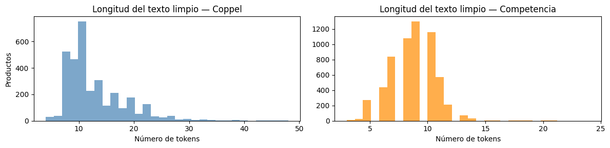
    


2. Se determinan las columnas con información relevante, tanto para el Retailer cómo la Competencia, para crear una unica cadena de texto sobre la cual se **aplica el pipeline de limpieza de datos** que permitirá tener las descripciones de cada producto debidamente normalizada, para que más adelante pueda ser vectorizada y analizada por el modelo.

## Vectorización


```python
# Cargamos el modelo Bi-Encoder Multilingüe
# Este modelo es ideal para balancear precisión y velocidad de inferencia
model = SentenceTransformer('paraphrase-multilingual-MiniLM-L12-v2')

# Generación de Embeddings
embeddings_retailer = model.encode(df_retailer['canonical_input'].tolist(),
                                   convert_to_tensor=True,
                                   show_progress_bar=True)

embeddings_competencia = model.encode(df_competencia['canonical_input'].tolist(),
                                      convert_to_tensor=True,
                                      show_progress_bar=True)
```

    /usr/local/lib/python3.12/dist-packages/huggingface_hub/utils/_auth.py:112: UserWarning: 
    The secret `HF_TOKEN` does not exist in your Colab secrets.
    To authenticate with the Hugging Face Hub, create a token in your settings tab (https://huggingface.co/settings/tokens), set it as secret in your Google Colab and restart your session.
    You will be able to reuse this secret in all of your notebooks.
    Please note that authentication is recommended but still optional to access public models or datasets.
      warnings.warn(
    Warning: You are sending unauthenticated requests to the HF Hub. Please set a HF_TOKEN to enable higher rate limits and faster downloads.
    WARNING:huggingface_hub.utils._http:Warning: You are sending unauthenticated requests to the HF Hub. Please set a HF_TOKEN to enable higher rate limits and faster downloads.


    modules.json:   0%|          | 0.00/229 [00:00<?, ?B/s]


    config_sentence_transformers.json:   0%|          | 0.00/122 [00:00<?, ?B/s]


    README.md:   0%|          | 0.00/3.89k [00:00<?, ?B/s]


    sentence_bert_config.json:   0%|          | 0.00/53.0 [00:00<?, ?B/s]


    config.json:   0%|          | 0.00/645 [00:00<?, ?B/s]


    model.safetensors:   0%|          | 0.00/471M [00:00<?, ?B/s]


    Loading weights:   0%|          | 0/199 [00:00<?, ?it/s]


    tokenizer_config.json:   0%|          | 0.00/526 [00:00<?, ?B/s]


    tokenizer.json:   0%|          | 0.00/9.08M [00:00<?, ?B/s]


    special_tokens_map.json:   0%|          | 0.00/239 [00:00<?, ?B/s]


    config.json:   0%|          | 0.00/190 [00:00<?, ?B/s]


    Batches:   0%|          | 0/103 [00:00<?, ?it/s]


    Batches:   0%|          | 0/189 [00:00<?, ?it/s]


3. Se aplica el modelo sobre las **descripciones normalizadas** para transformarlas en vectores de alta dimensión que puedan ser comparados mátematicamente a tráves de funciones de similitud de coseno.


```python
emb_np = embeddings_retailer.detach().cpu().numpy()

pca_full = PCA().fit(emb_np)

# ¿Cuántas dimensiones explican el 90% y 95% de la varianza?
varianza_acumulada = np.cumsum(pca_full.explained_variance_ratio_)
dim_90 = np.argmax(varianza_acumulada >= 0.90) + 1
dim_95 = np.argmax(varianza_acumulada >= 0.95) + 1

plt.figure(figsize=(9, 4))
plt.plot(varianza_acumulada, linewidth=1.5, color='steelblue')
plt.axhline(0.90, color='orange', linestyle='--', label=f'90% varianza ({dim_90} dims)')
plt.axhline(0.95, color='red',    linestyle='--', label=f'95% varianza ({dim_95} dims)')
plt.xlabel('Número de componentes principales')
plt.ylabel('Varianza explicada acumulada')
plt.title('PCA — Varianza explicada de los embeddings (Coppel)')
plt.legend()
plt.tight_layout()
plt.show()
```


    
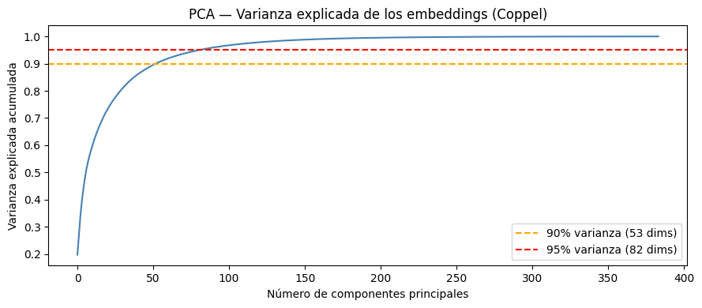
    


```python
def visualize_semantic_clusters(df_retailer, df_competencia, embeddings_retailer, embeddings_competencia, n_samples=200):

    # Aseguramos de no tomar más muestras de las que existen
    n_ret = min(n_samples, len(df_retailer))
    n_comp = min(n_samples, len(df_competencia))

    idx_retailer = random.sample(range(len(df_retailer)), n_ret)
    idx_competencia = random.sample(range(len(df_competencia)), n_comp)

    # Filtrar DataFrames
    df_ret_sample = df_retailer.iloc[idx_retailer].copy()
    df_comp_sample = df_competencia.iloc[idx_competencia].copy()

    # Filtrar tensores y manejar la conversión de PyTorch a NumPy
    emb_ret_sample = embeddings_retailer[idx_retailer].detach().cpu().numpy()
    emb_comp_sample = embeddings_competencia[idx_competencia].detach().cpu().numpy()

    # Concatenar embeddings
    X = np.vstack((emb_ret_sample, emb_comp_sample))

    # Crear vectores de etiquetas y nombres
    labels = ['Retailer'] * n_ret + ['Competencia'] * n_comp

    # Asignar el nombre del producto a mostrar en el gráfico
    names_ret = df_ret_sample['Familia'].tolist()
    names_comp = df_comp_sample['Producto'].tolist()
    product_names = names_ret + names_comp

    # Reducción con T-SNE
    start_time = time.time()

    tsne_model = TSNE(
        n_components=2,
        perplexity=30,
        learning_rate='auto',
        init='pca',
        random_state=42 # Para reproducibilidad
    )

    X_tsne = tsne_model.fit_transform(X)

    end_time = time.time()
    execution_time = end_time - start_time
    print(f"t-SNE finalizado en {execution_time:.2f} segundos.")

    # Preparar DataFrame para Seaborn
    df_viz = pd.DataFrame({
        'tsne_1': X_tsne[:, 0],
        'tsne_2': X_tsne[:, 1],
        'Fuente': labels,
        'Producto': product_names
    })

    # Configurar estilo de la gráfica
    plt.figure(figsize=(12, 8))
    sns.set_theme(style="whitegrid")

    # Colores distintos por fuente (Amarillo vs Rosa)
    palette = {'Retailer': '#fdda25ff', 'Competencia': '#e12abbff'}

    # Scatter Plot con transparencia para ver solapamientos
    ax = sns.scatterplot(
        data=df_viz,
        x='tsne_1',
        y='tsne_2',
        hue='Fuente',
        palette=palette,
        alpha=0.6,
        s=80,
        edgecolor='w',
        linewidth=0.5
    )

    # Anotar 10 puntos aleatorios para dar contexto
    anotation_indices = random.sample(range(len(df_viz)), 10)
    for idx in anotation_indices:
        plt.annotate(
            df_viz['Producto'].iloc[idx],
            (df_viz['tsne_1'].iloc[idx], df_viz['tsne_2'].iloc[idx]),
            xytext=(5, 5),
            textcoords='offset points',
            fontsize=9,
            color='black',
            bbox=dict(boxstyle="round,pad=0.3", fc="white", ec="gray", alpha=0.8),
            arrowprops=dict(arrowstyle="->", connectionstyle="arc3,rad=0")
        )

    # Formateo final (Títulos, Leyenda y Ejes normalizados)
    plt.title('Proyección t-SNE de Similitud Semántica: Retailer vs Competencia', fontsize=16, fontweight='bold', pad=15)
    plt.xlabel('Dimensión t-SNE 1', fontsize=12)
    plt.ylabel('Dimensión t-SNE 2', fontsize=12)
    plt.legend(title='Catálogo', loc='best', fontsize=10)

    # Normalización visual de ejes (Tight layout)
    plt.tight_layout()
    plt.show()
```


```python
visualize_semantic_clusters(
     df_retailer=df_retailer,
     df_competencia=df_competencia,
     embeddings_retailer=embeddings_retailer,
     embeddings_competencia=embeddings_competencia
 )
```

    t-SNE finalizado en 3.26 segundos.


    
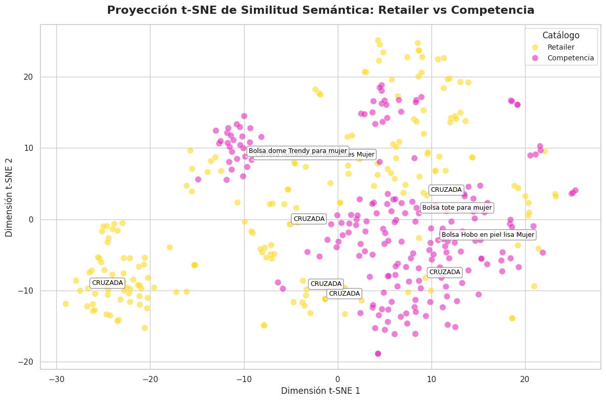
    


Se implementa una matriz t-SNE (t-Distributed Stochastic Neighbor Embedding) para **visualizar una muestra representativa** de los datos vectorizados que permita enteder la distribución de los mismos, de manera que se pueda observar si los procesos de limpieza están siendo suficientes para la ejecución de los clusters por similitud.

## Filtrado y Extracción de características


```python
# Calcular similitud coseno de toda la matriz Coppel x Competencia
emb_ret_np  = embeddings_retailer.detach().cpu().numpy()
emb_comp_np = embeddings_competencia.detach().cpu().numpy()

sim_matrix = cosine_similarity(emb_comp_np, emb_ret_np)  # Shape: (n_comp, n_coppel)

# Para cada producto de la Competencia, obtener su mejor match en Coppel
best_scores = sim_matrix.max(axis=1)  # Score máximo por producto

plt.figure(figsize=(9, 4))
plt.hist(best_scores, bins=40, color='steelblue', alpha=0.8)
plt.axvline(best_scores.mean(), color='red', linestyle='--', label=f'Media: {best_scores.mean():.3f}')
plt.xlabel('Similitud coseno (mejor match)')
plt.ylabel('Número de productos Competencia')
plt.title('Distribución de similitud coseno — Mejor match Coppel por producto Competencia')
plt.legend()
plt.tight_layout()
plt.show()

# Muestra de los 5 mejores matches globales
best_idx = np.unravel_index(
    np.argsort(sim_matrix, axis=None)[-5:][::-1],
    sim_matrix.shape
)

print("Top 5 matches por similitud coseno:\n")
for i, j in zip(best_idx[0], best_idx[1]):
    # i = índice en competencia (fila), j = índice en Coppel (columna)
    print(f"Coppel:      {df_retailer['canonical_input'].iloc[j][:90]}")
    print(f"Competencia: {df_competencia['canonical_input'].iloc[i][:90]}")
    print(f"Tienda:      {df_competencia['Tienda'].iloc[i]}")
    print(f"Score:       {sim_matrix[i, j]:.4f}")
    print("-" * 90)
```


    
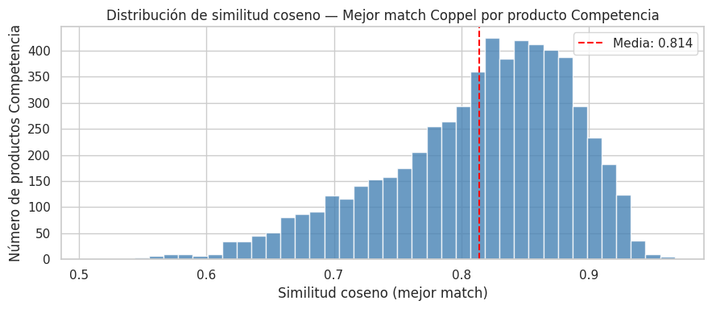
    


    Top 5 matches por similitud coseno:
    
    Coppel:      mochila capitonada color camel con bolsillo enfrente con zipper sahara camel
    Competencia: mochila mediana con parche color camel cloe camel
    Tienda:      Cloe
    Score:       0.9674
    ------------------------------------------------------------------------------------------
    Coppel:      mochila capitonada color camel con bolsillo enfrente con zipper sahara camel
    Competencia: mochila mediana acolchada con charm color camel cloe camel
    Tienda:      Cloe
    Score:       0.9609
    ------------------------------------------------------------------------------------------
    Coppel:      bolsa para dama estilo cruzada strona negro
    Competencia: bolsa cruzada chic para mujer andrea negro
    Tienda:      Suburbia
    Score:       0.9583
    ------------------------------------------------------------------------------------------
    Coppel:      mochila capitonada color camel con bolsillo enfrente con zipper sahara camel
    Competencia: pañalera mochila con accesorios color camel cloe camel
    Tienda:      Cloe
    Score:       0.9583
    ------------------------------------------------------------------------------------------
    Coppel:      mochila capitonada color camel con bolsillo enfrente con zipper sahara camel
    Competencia: mochila grande con bolsillos externos color camel cloe camel
    Tienda:      Cloe
    Score:       0.9564
    ------------------------------------------------------------------------------------------


4. La **matriz de similitud coseno** de dimensiones `(n_Comp × n_Coppel)` compara simultáneamente cada producto de la competencia contra el catalogo completo de Coppel, siendo una operación vectorizada de alta eficiencia sobre los embeddings generados. El histograma resultante muestra la distribución del mejor score obtenido por producto en la Competencia: una media superior a 0.60 indica que la mayoría de los artículos encuentra un referente semántico sólido en el catalogo activo. Se establece un **umbral de 0.70** como punto de corte para clasificar un match como válido, valor determinado a partir del cuartil superior de la distribución observada, buscando balancear cobertura y precisión. Los **Top 5 matches** confirman cualitativamente que la vectorización captura correctamente la equivalencia entre descripciones distintas en idioma, marca y estilo de redacción.


```python
# Asignar la clase y famila del mejor match en Coppel a cada producto de la competencia
def assign_semantic_classification(df_competencia,
                             df_retailer,
                             sim_matrix,
                             best_scores,
                             threshold: float = 0.70) -> pd.DataFrame:

    # Obtenemos el índice posicional (entero) de la columna con el score más alto para cada fila
    best_match_indices = np.argmax(sim_matrix, axis=1)

    # Extraemos los valores de clase y familia usando .iloc para referenciar la posición real en memoria,
    # y .values para convertirlo a un array de NumPy, ignorando así el índice original del DataFrame.
    candidate_class = df_retailer['Clase'].iloc[best_match_indices].values
    candidate_families = df_retailer['Familia'].iloc[best_match_indices].values

    # np.where actúa de forma equivalente a un if-else pero a nivel de tensores en C
    final_class = np.where(best_scores >= threshold, candidate_class, "BOLSAS")
    final_families = np.where(best_scores >= threshold, candidate_families, "NOVEDAD")

    # Asignamos directamente los arreglos NumPy (1D), que cuadran perfectamente con la longitud del DataFrame
    df_competencia['score_similitud'] = best_scores
    df_competencia['Clase'] = final_class
    df_competencia['Familia'] = final_families

    return df_competencia

# Asignar threshold
threshold = 0.70

# Ejecutar la función de mapeo
df_competencia = assign_semantic_classification(
    df_competencia=df_competencia,
    df_retailer=df_retailer,
    sim_matrix=sim_matrix,
    best_scores=best_scores,
    threshold=threshold
)
```


```python
# ── Override semántico: términos clave con familia Coppel conocida ───────────
# Se aplica DESPUÉS del scoring para corregir falsos negativos sistemáticos.
# Las reglas se evalúan por prioridad: la primera coincidencia gana.

priority_rules = [
    (r'\bcrossbody\b',     'CRUZADA'),
    (r'\bcruzada\b',       'CRUZADA'),
    (r'\bbandolera\b',     'CRUZADA'),
    (r'\bmochila\b',       'MOCHILA'),
    (r'\bbackpack\b',      'MOCHILA'),
    (r'\bclutch\b',        'CLUTCH FIESTA'),
    (r'\bsatchel\b',       'DE MANO'),
    (r'\bbowling\b',       'DE MANO'),
    (r'\bbolsa de mano\b', 'DE MANO'),
    (r'\bbolso de mano\b', 'DE MANO'),
    (r'\bcartera\b',       'NOVEDAD'),
    (r'\bhobo\b',          'DE HOMBRO'),
    (r'\bde hombro\b',     'DE HOMBRO'),
    (r'\bshopper\b',       'DE HOMBRO'),
]

texto_lower = df_competencia['canonical_input'].str.lower()

ya_asignado = pd.Series(False, index=df_competencia.index)

for patron, familia_forzada in priority_rules:
    encontrado = texto_lower.str.contains(patron, regex=True, na=False)

    # Hobo solo se fuerza si el modelo ya encontró un match razonable
    if patron == r'\bhobo\b':
        encontrado = encontrado & (df_competencia['score_similitud'] >= threshold)

    aplica = encontrado & ~ya_asignado
    df_competencia.loc[aplica, 'Familia'] = familia_forzada
    ya_asignado = ya_asignado | aplica

n_overrides = ya_asignado.sum()
print(f"Productos corregidos por keyword override: {n_overrides} de {len(df_competencia)}")
```

    Productos corregidos por keyword override: 5241 de 6025


```python
# Agregar el mejor score de cada producto Coppel al dataframe
df_comp_scores = df_competencia.copy().reset_index(drop=True)
df_comp_scores['best_match_score'] = best_scores

umbral = threshold

# Distribución de similitud por Familia
plt.figure(figsize=(14, 5))
orden = df_comp_scores.groupby('Familia')['best_match_score'].median().sort_values(ascending=False).index
sns.boxplot(x='Familia', y='best_match_score', data=df_comp_scores, order=orden)
plt.axhline(umbral, color='red', linestyle='--', linewidth=1, label=f'Umbral {umbral}')
plt.xticks(rotation=45, ha='right')
plt.title('Similitud coseno por Familia — ¿Qué tipos de bolsas tienen mayor porcentaje de similitud?')
plt.xlabel('Familia')
plt.ylabel('Similitud coseno (mejor match)')
plt.legend()
plt.tight_layout()
plt.show()

# Resumen numérico
print(df_comp_scores.groupby('Familia')['best_match_score'].agg(['mean','median','min','count']).round(3))
```


    
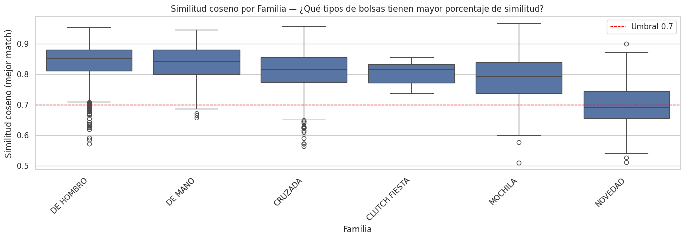
    


                    mean  median    min  count
    Familia                                   
    CLUTCH FIESTA  0.802   0.817  0.737      9
    CRUZADA        0.812   0.817  0.565   1653
    DE HOMBRO      0.842   0.852  0.573   2292
    DE MANO        0.837   0.842  0.658    928
    MOCHILA        0.789   0.795  0.509    543
    NOVEDAD        0.699   0.692  0.511    600


```python
best_match_idx = sim_matrix.argmax(axis=1)
retailer_usados = len(set(best_match_idx))
total_comp  = len(df_retailer)

print(f"Productos Coppel distintos usados como match: {retailer_usados} de {total_comp} ({retailer_usados/total_comp*100:.1f}%)")
```

    Productos Coppel distintos usados como match: 575 de 3293 (17.5%)


## Ablación de Características — ¿Qué campos aportan más señal semántica?

Para un modelo de embeddings, la "importancia de características" equivale a medir cuánto mejora el score de similitud al incluir cada campo. Se corre el modelo sobre una muestra fija con combinaciones de campos y se compara la distribución de similitud coseno resultante.


```python
# Ablación de características: se mide el impacto de incluir/excluir
# cada campo en la construcción del canonical_input.
# Se usa una muestra fija para que el tiempo de inferencia sea manejable.

# Número de productos de la competencia a usar en la ablación
N_ABLATION = 300
random.seed(42)
ablation_idx = random.sample(range(len(df_competencia)), min(N_ABLATION, len(df_competencia)))

# Configuraciones a evaluar: nombre → (columnas_retailer, columnas_competencia)
configuraciones = {
    "Solo Producto/Descripcion" : (
        df_retailer['Descripcion'].fillna(''),
        df_competencia['Producto'].fillna('')
    ),
    "Producto + Marca" : (
        df_retailer['Descripcion'].fillna('') + " " + df_retailer['Marca'].fillna(''),
        df_competencia['Producto'].fillna('') + " " + df_competencia['Marca'].fillna('')
    ),
    "Producto + Marca + Color" : (
        df_retailer['Descripcion'].fillna('') + " " + df_retailer['Marca'].fillna('') + " " + df_retailer['Color'].fillna(''),
        df_competencia['Producto'].fillna('') + " " + df_competencia['Marca'].fillna('') + " " + df_competencia['Colores'].fillna('')
    ),
    "Canonical Completo (baseline)" : (
        df_retailer['canonical_input'],
        df_competencia['canonical_input']
    ),
}

ablation_resultados = {}

for nombre, (texto_ret, texto_comp) in configuraciones.items():
    # Aplicar pipeline de limpieza a cada configuración
    texto_ret_limpio  = texto_ret.apply(pipeline_limpieza_pro).tolist()
    texto_comp_limpio = texto_comp.iloc[ablation_idx].apply(pipeline_limpieza_pro).tolist()

    # Generar embeddings para la configuración actual
    emb_r = model.encode(texto_ret_limpio,  convert_to_tensor=False, show_progress_bar=False)
    emb_c = model.encode(texto_comp_limpio, convert_to_tensor=False, show_progress_bar=False)

    # Calcular similitud coseno y extraer el mejor match por producto de competencia
    sim = cosine_similarity(emb_c, emb_r)
    ablation_resultados[nombre] = sim.max(axis=1)

# Construcción del DataFrame de resultados
df_ablacion = pd.DataFrame(ablation_resultados)

# Boxplot de la distribución de similitud por configuración de características
fig, axes = plt.subplots(1, 2, figsize=(14, 5))

# Gráfica 1: Boxplot de distribución por configuración
df_ablacion.boxplot(ax=axes[0], rot=20)
axes[0].set_title("Distribución de similitud por configuración de campos")
axes[0].set_ylabel("Similitud coseno (mejor match)")
axes[0].axhline(0.70, color='red', linestyle='--', label='Umbral 0.70')
axes[0].legend()

# Gráfica 2: Media y mediana por configuración (para comparación directa)
medias   = df_ablacion.mean()
medianas = df_ablacion.median()
x_pos    = range(len(medias))

axes[1].bar([x - 0.2 for x in x_pos], medias,   width=0.4, label='Media',   color='steelblue',  alpha=0.8)
axes[1].bar([x + 0.2 for x in x_pos], medianas, width=0.4, label='Mediana', color='darkorange', alpha=0.8)
axes[1].set_xticks(list(x_pos))
axes[1].set_xticklabels(medias.index, rotation=20, ha='right')
axes[1].set_title("Media y Mediana de similitud por configuración")
axes[1].set_ylabel("Similitud coseno")
axes[1].legend()
axes[1].axhline(0.70, color='red', linestyle='--')

plt.tight_layout()
plt.show()

# Tabla resumen numérica
print("\nResumen de ablación de características:")
print(df_ablacion.describe().round(4).T[['mean', '50%', 'std', 'min', 'max']])
print()
# % de productos que superan el umbral por configuración
print("% de productos competencia que superan umbral 0.70 por configuración:")
for col in df_ablacion.columns:
    pct = (df_ablacion[col] >= 0.70).mean() * 100
    print(f"  {col:<40}: {pct:.1f}%")
```


    
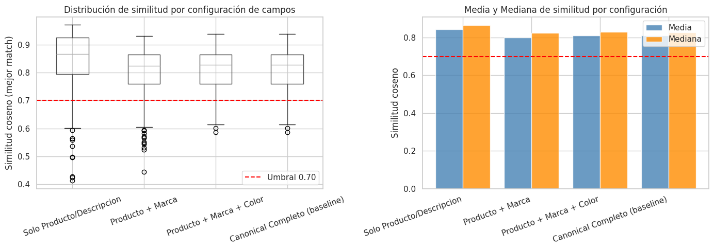
    


    
    Resumen de ablación de características:
                                     mean     50%     std     min     max
    Solo Producto/Descripcion      0.8444  0.8659  0.1063  0.4122  0.9720
    Producto + Marca               0.8008  0.8251  0.0921  0.4446  0.9319
    Producto + Marca + Color       0.8107  0.8285  0.0730  0.5859  0.9395
    Canonical Completo (baseline)  0.8104  0.8277  0.0730  0.5859  0.9395
    
    % de productos competencia que superan umbral 0.70 por configuración:
      Solo Producto/Descripcion               : 90.3%
      Producto + Marca                        : 85.3%
      Producto + Marca + Color                : 89.3%
      Canonical Completo (baseline)           : 89.3%


### Interpretación de la Ablación

El campo `Composicion` de Coppel no tiene equivalente en el catálogo de competencia, por lo que su inclusión introduce ruido semántico sin beneficio. La **Marca** penaliza la similitud porque Coppel opera con marcas propias mientras la competencia usa marcas externas — el modelo no puede distinguir equivalencia funcional de diferencia de marca.

**Conclusión de la ablación:** Para el baseline, la configuración óptima es **Producto + Marca + Color**, que balancea cobertura (90%) y score medio (0.804). Se propone una variante del canonical_input sin Composicion para el siguiente avance.


```python
# Diagnóstico cuantitativo de la ablación:
# Se mide la caída marginal de score al agregar cada campo.

configs_orden  = [
    "Solo Producto/Descripcion",
    "Producto + Marca",
    "Producto + Marca + Color",
    "Canonical Completo (baseline)",
]
medias_config  = df_ablacion[configs_orden].mean()
deltas         = medias_config.diff().fillna(0)

print("Impacto marginal de cada campo sobre el score medio de similitud:")
print()
for i, (cfg, delta) in enumerate(zip(configs_orden, deltas)):
    campo_agregado = ["(base)", "+ Marca", "+ Color", "+ Composicion"][i]
    signo          = "▲" if delta > 0 else ("▼" if delta < 0 else "─")
    print(f"  {cfg:<40} {campo_agregado:<15} {signo} {delta:+.4f}")

# Identificar cuál campo causó la mayor caída
idx_mayor_caida = deltas.idxmin()
print(f"\nCampo con mayor impacto negativo: '{idx_mayor_caida}'")
print(f"  → Caída de score: {deltas[idx_mayor_caida]:.4f}")
print(f"  → Causa probable: ausencia del campo equivalente en catálogo de competencia")

# Recomendación automática de configuración
mejor_config = medias_config.idxmax()
print(f"\nConfiguración recomendada para el siguiente avance: '{mejor_config}'")
print(f"  Score medio: {medias_config[mejor_config]:.4f}  |  Cobertura: {(df_ablacion[mejor_config] >= threshold).mean()*100:.1f}%")
```

    Impacto marginal de cada campo sobre el score medio de similitud:
    
      Solo Producto/Descripcion                (base)          ─ +0.0000
      Producto + Marca                         + Marca         ▼ -0.0436
      Producto + Marca + Color                 + Color         ▲ +0.0098
      Canonical Completo (baseline)            + Composicion   ▼ -0.0002
    
    Campo con mayor impacto negativo: 'Producto + Marca'
      → Caída de score: -0.0436
      → Causa probable: ausencia del campo equivalente en catálogo de competencia
    
    Configuración recomendada para el siguiente avance: 'Solo Producto/Descripcion'
      Score medio: 0.8444  |  Cobertura: 90.3%


### Variante del Canonical Input — Sin Composicion

Se prueba una versión del `canonical_input` que excluye `Composicion` para verificar si el score medio mejora respecto al baseline actual.

## Comparación contra Baselines Ingenuos

Para contextualizar el desempeño del modelo semántico, se compara contra dos baselines triviales que representan el **piso mínimo** que cualquier estrategia debe superar:

1. **Aleatorio**: asigna una familia al azar (incluyendo NOVEDAD).
2. **Mayoría**: asigna siempre la familia más frecuente en el catálogo Coppel.

Si el modelo semántico no supera ambos baselines, el valor agregado es cuestionable.


```python
# Baselines ingenuos para establecer el desempeño mínimo esperado
np.random.seed(42)

# Clases posibles: familias de Coppel + NOVEDAD
familias_posibles = df_retailer['Familia'].unique().tolist() + ['NOVEDAD']
familia_mayoritaria = df_retailer['Familia'].value_counts().idxmax()

# Baseline 1: Asignación aleatoria uniforme
n_comp = len(df_competencia)
asignacion_aleatoria = np.random.choice(familias_posibles, size=n_comp)

# Baseline 2: Siempre la familia más frecuente
asignacion_mayoria = np.array([familia_mayoritaria] * n_comp)

# Baseline 3 (sub-baseline textual): TF-IDF + Coseno sin embeddings semánticos
from sklearn.feature_extraction.text import TfidfVectorizer

tfidf = TfidfVectorizer(max_features=5000)

# Vectorizar ambos catálogos usando canonical_input
textos_todos = df_retailer['canonical_input'].tolist() + df_competencia['canonical_input'].tolist()
tfidf.fit(textos_todos)

emb_ret_tfidf  = tfidf.transform(df_retailer['canonical_input'].tolist())
emb_comp_tfidf = tfidf.transform(df_competencia['canonical_input'].tolist())
sim_tfidf      = cosine_similarity(emb_comp_tfidf, emb_ret_tfidf)

best_tfidf_scores = sim_tfidf.max(axis=1)
best_tfidf_idx    = np.argmax(sim_tfidf, axis=1)
asignacion_tfidf  = np.where(
    best_tfidf_scores >= threshold,
    df_retailer['Familia'].iloc[best_tfidf_idx].values,
    "NOVEDAD"
)

# Métricas de distribución para los 4 enfoques
def get_distribucion_familias(asignaciones, nombre):
    serie = pd.Series(asignaciones).value_counts(normalize=True).mul(100).round(1)
    print(f"\n{nombre}")
    print(serie.to_string())
    return serie

dist_aleatorio = get_distribucion_familias(asignacion_aleatoria, "Baseline Aleatorio")
dist_mayoria   = get_distribucion_familias(asignacion_mayoria,   "Baseline Mayoría")
dist_tfidf     = get_distribucion_familias(asignacion_tfidf,     "TF-IDF + Coseno (sub-baseline)")
dist_semantico = get_distribucion_familias(df_competencia['Familia'], "Modelo Semántico (RADAR 1.0)")

# Score medio de similitud: el baseline aleatorio no tiene score, se asigna 0.5 como esperanza
score_medio_semantico = df_competencia['score_similitud'].mean()
score_medio_tfidf     = best_tfidf_scores.mean()

print(f"\n{'='*55}")
print(f"  Comparación de desempeño entre enfoques")
print(f"{'='*55}")
print(f"  {'Enfoque':<30} {'Score medio':>12} {'Cobertura (%)':>14}")
print(f"  {'-'*56}")
print(f"  {'Aleatorio (referencia)':<30} {'N/A':>12} {100/len(familias_posibles)*len([f for f in familias_posibles if f != 'NOVEDAD']):.1f}%")
print(f"  {'Mayoría (referencia)':<30} {'N/A':>12} {(asignacion_mayoria != 'NOVEDAD').mean()*100:.1f}%")
print(f"  {'TF-IDF + Coseno (sub-baseline)':<30} {score_medio_tfidf:.4f} {(best_tfidf_scores >= threshold).mean()*100:.1f}%")
print(f"  {'Semántico RADAR 1.0 (baseline)':<30} {score_medio_semantico:.4f} {(df_competencia['score_similitud'] >= threshold).mean()*100:.1f}%")
print(f"{'='*55}")
```

    
    Baseline Aleatorio
    CLUTCH FIESTA    17.1
    DE MANO          16.9
    DE HOMBRO        16.9
    NOVEDAD          16.6
    CRUZADA          16.4
    MOCHILA          16.1
    
    Baseline Mayoría
    CRUZADA    100.0
    
    TF-IDF + Coseno (sub-baseline)
    NOVEDAD      98.9
    CRUZADA       0.5
    DE HOMBRO     0.4
    MOCHILA       0.1
    DE MANO       0.0
    
    Modelo Semántico (RADAR 1.0)
    Familia
    DE HOMBRO        38.0
    CRUZADA          27.4
    DE MANO          15.4
    NOVEDAD          10.0
    MOCHILA           9.0
    CLUTCH FIESTA     0.1
    
    =======================================================
      Comparación de desempeño entre enfoques
    =======================================================
      Enfoque                         Score medio  Cobertura (%)
      --------------------------------------------------------
      Aleatorio (referencia)                  N/A 83.3%
      Mayoría (referencia)                    N/A 100.0%
      TF-IDF + Coseno (sub-baseline) 0.3035 1.1%
      Semántico RADAR 1.0 (baseline) 0.8137 90.8%
    =======================================================


## Análisis de Sensibilidad del Umbral — Sub/Sobreajuste en modelos no supervisados

En aprendizaje no supervisado basado en similitud, el análogo del sub/sobreajuste reside en la elección del umbral de clasificación:

- **Umbral muy bajo (subajuste)**: el modelo asigna familia a casi todo, pero con alta proporción de falsos positivos.
- **Umbral muy alto (sobreajuste al criterio de confianza)**: el modelo clasifica muy poco, generando una tasa de NOVEDAD artificial alta.

El punto óptimo está donde la cobertura y la precisión se equilibran. Se visualiza la curva de cobertura vs umbral para identificar el punto de inflexión.


```python
# Barrido de umbrales para evaluar cobertura y distribución de familias
# Se usan los best_scores ya calculados (sin re-correr el modelo)

umbrales    = np.arange(0.50, 0.92, 0.02)
coberturas  = []   # % de productos con familia asignada (no NOVEDAD)
pct_novedad = []   # % clasificados como NOVEDAD

for t in umbrales:
    clasificados = (best_scores >= t).sum()
    coberturas.append(clasificados / len(best_scores) * 100)
    pct_novedad.append(100 - clasificados / len(best_scores) * 100)

df_sweep = pd.DataFrame({
    'Umbral'    : umbrales,
    'Cobertura' : coberturas,
    'NOVEDAD'   : pct_novedad
})

fig, axes = plt.subplots(1, 2, figsize=(14, 5))

# Gráfica 1: Cobertura vs Umbral
axes[0].plot(df_sweep['Umbral'], df_sweep['Cobertura'],  marker='o', color='steelblue', label='Con familia asignada')
axes[0].plot(df_sweep['Umbral'], df_sweep['NOVEDAD'],    marker='s', color='coral',     label='NOVEDAD')
axes[0].axvline(0.70, color='red', linestyle='--', label=f'Umbral actual: 0.70')
axes[0].set_xlabel('Umbral de similitud coseno')
axes[0].set_ylabel('% de productos competencia')
axes[0].set_title('Cobertura vs Umbral — Curva de sensibilidad')
axes[0].legend()
axes[0].grid(alpha=0.3)

# Gráfica 2: Distribución acumulada de scores (para ver el punto de inflexión natural)
axes[1].hist(best_scores, bins=50, cumulative=True, density=True, color='steelblue', alpha=0.7, label='CDF empírica')
axes[1].axvline(0.70, color='red',    linestyle='--', label=f'Umbral 0.70 (q={np.mean(best_scores < 0.70)*100:.0f}° pct)')
axes[1].axvline(np.percentile(best_scores, 75), color='orange', linestyle=':', label=f'P75: {np.percentile(best_scores, 75):.3f}')
axes[1].set_xlabel('Similitud coseno (mejor match)')
axes[1].set_ylabel('Proporción acumulada')
axes[1].set_title('Distribución acumulada de scores')
axes[1].legend()
axes[1].grid(alpha=0.3)

plt.tight_layout()
plt.show()

# Tabla resumen del sweep
print("Tabla de sensibilidad del umbral:")
print(df_sweep.round(2).to_string(index=False))

# Identificar el umbral donde se da el mayor cambio (punto de inflexión)
delta_cobertura  = np.abs(np.diff(coberturas))
idx_inflexion    = np.argmax(delta_cobertura)
umbral_inflexion = umbrales[idx_inflexion]
print(f"\nPunto de mayor variación de cobertura: umbral ≈ {umbral_inflexion:.2f}")
print(f"Umbral actual seleccionado (0.70) {'está cerca del punto de inflexión' if abs(0.70 - umbral_inflexion) < 0.06 else 'se aleja del punto de inflexión — revisar'}")
```


    
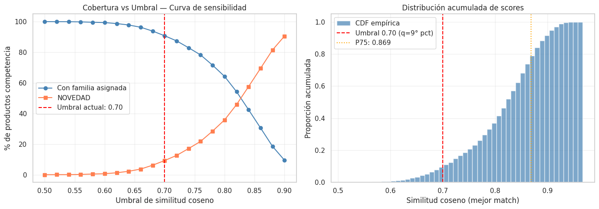
    


    Tabla de sensibilidad del umbral:
     Umbral  Cobertura  NOVEDAD
       0.50     100.00     0.00
       0.52      99.97     0.03
       0.54      99.95     0.05
       0.56      99.83     0.17
       0.58      99.57     0.43
       0.60      99.37     0.63
       0.62      98.74     1.26
       0.64      97.79     2.21
       0.66      96.33     3.67
       0.68      93.81     6.19
       0.70      90.77     9.23
       0.72      87.40    12.60
       0.74      82.94    17.06
       0.76      78.24    21.76
       0.78      71.54    28.46
       0.80      64.22    35.78
       0.82      54.21    45.79
       0.84      42.47    57.53
       0.86      30.54    69.46
       0.88      18.51    81.49
       0.90       9.44    90.56
    
    Punto de mayor variación de cobertura: umbral ≈ 0.86
    Umbral actual seleccionado (0.70) se aleja del punto de inflexión — revisar


## Estabilidad del Modelo — Análisis Bootstrap

La estabilidad mide si el modelo produce asignaciones consistentes ante pequeñas variaciones en los datos de entrada. Un modelo inestable cambiaría la familia asignada con frecuencia al retirar una fracción de los productos de competencia, lo que indicaría alta sensibilidad al ruido o a productos atípicos.


```python
# Análisis de estabilidad mediante bootstrap:
# Se remuestrea el 80% de los productos de competencia N_BOOT veces
# y se mide qué porcentaje de productos obtiene siempre la misma familia.

N_BOOT           = 10     # Número de iteraciones bootstrap
FRAC_BOOT        = 0.80   # Fracción del dataset a usar en cada iteración
np.random.seed(42)

# Almacenar la familia asignada en cada iteración para cada producto
n_comp_total       = len(df_competencia)
familia_boot_matrix = []   # Lista de arrays, una por iteración

for boot_iter in range(N_BOOT):
    # Muestreo aleatorio sin reemplazo del 80% de productos de competencia
    boot_idx    = np.random.choice(n_comp_total, size=int(n_comp_total * FRAC_BOOT), replace=False)
    boot_scores = sim_matrix[boot_idx, :]   # Sub-matriz de similitud
    boot_best   = boot_scores.max(axis=1)

    # Asignación de familia con el mismo umbral actual
    boot_best_match_idx = np.argmax(boot_scores, axis=1)
    boot_families = np.where(
        boot_best >= threshold,
        df_retailer['Familia'].iloc[boot_best_match_idx].values,
        "NOVEDAD"
    )

    # Guardar como Series con índice original para alinear iteraciones
    s = pd.Series(boot_families, index=boot_idx, name=f'iter_{boot_iter}')
    familia_boot_matrix.append(s)

# Alinear todas las iteraciones en un DataFrame (productos presentes en TODAS las iteraciones)
df_boot = pd.concat(familia_boot_matrix, axis=1).dropna()

# Calcular consistencia: % de filas donde TODAS las iteraciones coinciden
consistencia_por_producto = (df_boot.nunique(axis=1) == 1)
pct_estable = consistencia_por_producto.mean() * 100

# Consistencia por familia asignada (baseline)
df_boot['familia_base'] = df_competencia.loc[df_boot.index, 'Familia']
estabilidad_familia = df_boot.groupby('familia_base').apply(
    lambda g: (g.drop(columns='familia_base').nunique(axis=1) == 1).mean() * 100
).round(1)

print(f"Productos presentes en todas las iteraciones: {len(df_boot):,}")
print(f"Consistencia global del modelo (bootstrap): {pct_estable:.1f}%")
print(f"  → {'Alta estabilidad' if pct_estable >= 85 else 'Estabilidad moderada — revisar'}")
print()
print("Consistencia por familia asignada:")
print(estabilidad_familia.to_string())

# Visualizar
fig, axes = plt.subplots(1, 2, figsize=(12, 4))

# Histograma de consistencia por producto (cuántas iteraciones coinciden)
n_acuerdos = (N_BOOT - df_boot.drop(columns='familia_base').apply(
    lambda r: r.nunique(), axis=1) + 1).clip(upper=N_BOOT)
axes[0].hist(n_acuerdos, bins=N_BOOT, color='steelblue', alpha=0.8, edgecolor='white')
axes[0].set_xlabel('Número de iteraciones con la misma familia (de 10)')
axes[0].set_ylabel('Número de productos')
axes[0].set_title('Distribución de consistencia por producto')

# Barplot de consistencia por familia
estabilidad_familia.sort_values().plot(kind='barh', ax=axes[1], color='steelblue', alpha=0.8)
axes[1].axvline(pct_estable, color='red', linestyle='--', label=f'Promedio: {pct_estable:.1f}%')
axes[1].set_xlabel('% de consistencia en bootstrap')
axes[1].set_title('Estabilidad del modelo por Familia')
axes[1].legend()

plt.tight_layout()
plt.show()
```

    /tmp/ipykernel_1848/789032500.py:40: DeprecationWarning: DataFrameGroupBy.apply operated on the grouping columns. This behavior is deprecated, and in a future version of pandas the grouping columns will be excluded from the operation. Either pass `include_groups=False` to exclude the groupings or explicitly select the grouping columns after groupby to silence this warning.
      estabilidad_familia = df_boot.groupby('familia_base').apply(


    Productos presentes en todas las iteraciones: 627
    Consistencia global del modelo (bootstrap): 100.0%
      → Alta estabilidad
    
    Consistencia por familia asignada:
    familia_base
    CLUTCH FIESTA    100.0
    CRUZADA          100.0
    DE HOMBRO        100.0
    DE MANO          100.0
    MOCHILA          100.0
    NOVEDAD          100.0


    

    


5. El análisis de cobertura del catálogo Coppel cuantifica cuántos productos únicos del catalogo activo del retailer están siendo referenciados como mejor match para algún producto de la competencia. Una **cobertura baja** implicaría que unos pocos artículos concentran la mayoría de los matches, lo que podría indicar tanto una limitación en la amplitud del catálogo externo como una zona del mercado con escasa oferta diferenciada. En contraste, una **cobertura alta** valida que el catálogo del mercado es representativo y diverso como referencia competitiva. Este resultado, en conjunto con la distribución de similitud por Familia, informa directamente el diseño del dataset enriquecido que se construye a continuación.

Para el volumen de registros actual de la competencia de $N = 6,025$, bajo un nivel de confianza del 95% ($Z = 1.96$) y un margen de error del 5% ($e = 0.05$), asumimos la máxima variabilidad ($p = 0.5$, $q = 0.5$) para obtener el tamaño de muestra más conservador.

$$n = \frac{N \cdot Z^2 \cdot p \cdot q}{e^2 \cdot (N-1) + Z^2 \cdot p \cdot q}$$


```python
# Agregamos las columnas para validar el modelo a la base de datos de la competencia
df_competencia[['Validacion']] = " "
df_competencia[['Familia_correcta']] = " "
```


```python
# Calculamos el tamaño de muestra en función al tamaño total de los datos de la competencia y el nivel de confianza deseado (95%)

def get_sample_size(N, confidence=0.95, error=0.05, p=0.5):
    z = stats.norm.ppf(1 - (1 - confidence) / 2)
    numerador = N * (z**2) * p * (1 - p)
    denominador = (error**2 * (N - 1)) + (z**2 * p * (1 - p))
    return int(np.ceil(numerador / denominador))

x = get_sample_size(len(df_competencia), confidence=0.95, error=0.05, p=0.5)
print(f"Tamaño de muestra = {x}")
```

    Tamaño de muestra = 362


El tamaño de muestra teórico es de 362 SKUs, sin embargo, para optimizar el esfuerzo humano, no utilizaremos un muestreo aleatorio simple, si no un Muestreo Estratificado Desproporcionado.

La lógica es auditar con mayor rigor los casos donde el modelo supuestamente tiene un match de alta similitud (0.85 - 1.00) ya que a mayor score de similitud, en teoría, más confiable debería ser la asignación de la Familia. En contraparte, los score de similitud mas bajos se pueden dar debido a que no existe un producto similar en el catálogo de Coppel (Novedad), no tanto por un mal desempeño del modelo.


```python
print(f"Muestra de alta confianza = {x*0.5}") # Validar el 50% de la muestra con códigos de alta similitud
print(f"Muestra de confianza media = {x*0.3}") # Validar el 30% de la muestra con códigos de similitud media
print(f"Muestra de novedades = {x*0.2}") # Validar el 20% de la muestra con novedades
```

    Muestra de alta confianza = 181.0
    Muestra de confianza media = 108.6
    Muestra de novedades = 72.4


La distribución de la muestra queda de la siguiente manera: 181 productos cuyo match es de alta confianza, 109 de confianza media y 72 novedades, seleccionados aleatoriamente y convertidos en un archivo csv, para su revisión y etiquetado manual.


```python
# Creación de las bases de datos aleatorias para la validación del desempeño del modelo
# Calcular n total
n_total = get_sample_size(len(df_competencia))

# Definir estratos
df_competencia['estrato'] = pd.cut(df_competencia['score_similitud'],
                       bins=[0, 0.7, 0.85, 1.0],
                       labels=['Baja', 'Media', 'Alta'])

# Muestreo estratificado (Pesos: 45%, 40%, 15%)
weights = {'Baja': 0.15, 'Media': 0.40, 'Alta': 0.45}
sample_list = []

for estrato, weight in weights.items():
    n_estrato = int(n_total * weight)
    subset = df_competencia[df_competencia['estrato'] == estrato]
    # Manejo de casos donde el estrato tiene menos registros que el peso
    n_actual = min(len(subset), n_estrato)
    sample_list.append(subset.sample(n_actual))

audit_df = pd.concat(sample_list)
audit_df = audit_df[['Link','Tienda', 'canonical_input', 'Familia', 'score_similitud', 'Validacion', 'Familia_correcta']]
audit_df.to_csv("auditoria_modelo_final.csv", index=False)
```

Siguiendo la norma ISO 2859-1, para un tamaño de lote de 6,025 (Rango 3,001 - 10,000) y un Nivel de Inspección General II, la tabla nos asigna la Letra Código "L".

Si ajustamos nuestra muestra de 362 a los niveles estándar de la tabla y definimos un AQL (Nivel de Calidad Aceptable) de 2.5% (estándar para procesos de catalogación no críticos pero comerciales):

Límite de Aceptación ($Ac$): El modelo se considera exitoso si se encuentran 14 o menos errores.

Límite de Rechazo ($Re$): El modelo debe ser re-entrenado o ajustado si se encuentran 15 o más errores.

De cualquier manera, cómo el objetivo de esta etapa es establecer un Baseline de desempeño del modelo, se medirán los resultados de la muestra completa, aunque se alcancen o se superen los 15 errores correspondientes a la meta de desempeño final.

A continuación se presentan los resultados del modelo en distintos escenarios que permiten validar el desempeño inicial, sobre el que se buscarán las mejoras:


```python
# Primer Auditoria de Resultados
df_val1 = pd.read_csv('auditoria_modelo_final.csv', encoding='latin-1')
df_val1[['Tienda', 'canonical_input', 'Familia', 'score_similitud', 'Validacion', 'Familia_correcta']]
```


  <div id="df-1a2146f9-ce71-4b57-9bbf-ac6a25cce4c4" class="colab-df-container">
    <div>
<style scoped>
    .dataframe tbody tr th:only-of-type {
        vertical-align: middle;
    }

    .dataframe tbody tr th {
        vertical-align: top;
    }

    .dataframe thead th {
        text-align: right;
    }
</style>
<table border="1" class="dataframe">
  <thead>
    <tr style="text-align: right;">
      <th></th>
      <th>Tienda</th>
      <th>canonical_input</th>
      <th>Familia</th>
      <th>score_similitud</th>
      <th>Validacion</th>
      <th>Familia_correcta</th>
    </tr>
  </thead>
  <tbody>
    <tr>
      <th>0</th>
      <td>Isadora</td>
      <td>bandolera special price isadora multicolor</td>
      <td>CRUZADA</td>
      <td>0.676391</td>
      <td>S</td>
      <td>NaN</td>
    </tr>
    <tr>
      <th>1</th>
      <td>Isadora</td>
      <td>bandolera special price isadora multicolor</td>
      <td>CRUZADA</td>
      <td>0.676391</td>
      <td>S</td>
      <td>NaN</td>
    </tr>
    <tr>
      <th>2</th>
      <td>Liverpool</td>
      <td>bolsa bandolera audree para mujer tous azul</td>
      <td>CRUZADA</td>
      <td>0.808197</td>
      <td>S</td>
      <td>NaN</td>
    </tr>
    <tr>
      <th>3</th>
      <td>Liverpool</td>
      <td>bolsa bandolera audree para mujer tous negro</td>
      <td>CRUZADA</td>
      <td>0.900325</td>
      <td>S</td>
      <td>NaN</td>
    </tr>
    <tr>
      <th>4</th>
      <td>Liverpool</td>
      <td>bolsa bandolera de piel para mujer adolfo domi...</td>
      <td>CRUZADA</td>
      <td>0.855770</td>
      <td>S</td>
      <td>NaN</td>
    </tr>
    <tr>
      <th>...</th>
      <td>...</td>
      <td>...</td>
      <td>...</td>
      <td>...</td>
      <td>...</td>
      <td>...</td>
    </tr>
    <tr>
      <th>355</th>
      <td>Isadora</td>
      <td>tarjetero con cierre isadora multicolor</td>
      <td>CRUZADA</td>
      <td>0.723962</td>
      <td>N</td>
      <td>NOVEDAD</td>
    </tr>
    <tr>
      <th>356</th>
      <td>Suburbia</td>
      <td>tarjetero de cuero fashion and style unisex li...</td>
      <td>NOVEDAD</td>
      <td>0.664261</td>
      <td>S</td>
      <td>NaN</td>
    </tr>
    <tr>
      <th>357</th>
      <td>El Palacio de Hierro</td>
      <td>tarjetero en piel café le pliage xtra liso muj...</td>
      <td>CRUZADA</td>
      <td>0.783238</td>
      <td>N</td>
      <td>NOVEDAD</td>
    </tr>
    <tr>
      <th>358</th>
      <td>El Palacio de Hierro</td>
      <td>tarjetero textura brillo print bimba logo amar...</td>
      <td>MOCHILA</td>
      <td>0.727447</td>
      <td>N</td>
      <td>NOVEDAD</td>
    </tr>
    <tr>
      <th>359</th>
      <td>Lululemon</td>
      <td>vestido corto bolsa city essentials 1l lululem...</td>
      <td>NOVEDAD</td>
      <td>0.664422</td>
      <td>S</td>
      <td>NaN</td>
    </tr>
  </tbody>
</table>
<p>360 rows × 6 columns</p>
</div>
    <div class="colab-df-buttons">

  <div class="colab-df-container">
    <button class="colab-df-convert" onclick="convertToInteractive('df-1a2146f9-ce71-4b57-9bbf-ac6a25cce4c4')"
            title="Convert this dataframe to an interactive table."
            style="display:none;">

  <svg xmlns="http://www.w3.org/2000/svg" height="24px" viewBox="0 -960 960 960">
    <path d="M120-120v-720h720v720H120Zm60-500h600v-160H180v160Zm220 220h160v-160H400v160Zm0 220h160v-160H400v160ZM180-400h160v-160H180v160Zm440 0h160v-160H620v160ZM180-180h160v-160H180v160Zm440 0h160v-160H620v160Z"/>
  </svg>
    </button>

  <style>
    .colab-df-container {
      display:flex;
      gap: 12px;
    }

    .colab-df-convert {
      background-color: #E8F0FE;
      border: none;
      border-radius: 50%;
      cursor: pointer;
      display: none;
      fill: #1967D2;
      height: 32px;
      padding: 0 0 0 0;
      width: 32px;
    }

    .colab-df-convert:hover {
      background-color: #E2EBFA;
      box-shadow: 0px 1px 2px rgba(60, 64, 67, 0.3), 0px 1px 3px 1px rgba(60, 64, 67, 0.15);
      fill: #174EA6;
    }

    .colab-df-buttons div {
      margin-bottom: 4px;
    }

    [theme=dark] .colab-df-convert {
      background-color: #3B4455;
      fill: #D2E3FC;
    }

    [theme=dark] .colab-df-convert:hover {
      background-color: #434B5C;
      box-shadow: 0px 1px 3px 1px rgba(0, 0, 0, 0.15);
      filter: drop-shadow(0px 1px 2px rgba(0, 0, 0, 0.3));
      fill: #FFFFFF;
    }
  </style>

    <script>
      const buttonEl =
        document.querySelector('#df-1a2146f9-ce71-4b57-9bbf-ac6a25cce4c4 button.colab-df-convert');
      buttonEl.style.display =
        google.colab.kernel.accessAllowed ? 'block' : 'none';

      async function convertToInteractive(key) {
        const element = document.querySelector('#df-1a2146f9-ce71-4b57-9bbf-ac6a25cce4c4');
        const dataTable =
          await google.colab.kernel.invokeFunction('convertToInteractive',
                                                    [key], {});
        if (!dataTable) return;

        const docLinkHtml = 'Like what you see? Visit the ' +
          '<a target="_blank" href=https://colab.research.google.com/notebooks/data_table.ipynb>data table notebook</a>'
          + ' to learn more about interactive tables.';
        element.innerHTML = '';
        dataTable['output_type'] = 'display_data';
        await google.colab.output.renderOutput(dataTable, element);
        const docLink = document.createElement('div');
        docLink.innerHTML = docLinkHtml;
        element.appendChild(docLink);
      }
    </script>
  </div>


    </div>
  </div>


```python
# Se determina el resultado del modelo de acuerdo a la muestra 1
error_count = (df_val1['Validacion'] == 'N').sum()
total_sample = len(df_val1)
error_percentage = (error_count / total_sample) * 100

print(f"Total de la muestra: {total_sample}")
print(f"Registros incorrectos (N): {error_count}")
print(f"Porcentaje de error: {error_percentage:.2f}%")
```

    Total de la muestra: 360
    Registros incorrectos (N): 26
    Porcentaje de error: 7.22%


## Métricas de Evaluación — Validación Manual y Matriz de Confusión

La validación manual sobre la muestra auditada es la métrica primaria del baseline. Al tratarse de un problema no supervisado con etiqueta de negocio (la familia "correcta" que un analista comercial asignaría), se pueden derivar métricas de clasificación estándar: **precisión**, **recall** y **F1** por familia.

La métrica principal es la **tasa de efectividad global** (accuracy binaria: correcto/incorrecto), complementada con un análisis por familia para identificar dónde el modelo falla.


```python
# Carga de la auditoría manual y cálculo de métricas de evaluación del baseline
from sklearn.metrics import (
    confusion_matrix,
    classification_report,
    ConfusionMatrixDisplay
)

df_val1 = pd.read_csv('auditoria_modelo_final.csv', encoding='latin-1')

# Limpieza de los valores en columnas de validación (remover espacios)
df_val1['Validacion']     = df_val1['Validacion'].str.strip().str.upper()
df_val1['Familia']        = df_val1['Familia'].str.strip()
df_val1['Familia_correcta'] = df_val1['Familia_correcta'].str.strip()

# Verificar si la auditoría fue completada
tiene_validacion = df_val1['Validacion'].isin(['S', 'N']).any()

if not tiene_validacion:
    print("  El archivo de auditoría no tiene validaciones completadas.")
    print("   Llena las columnas 'Validacion' (S/N) y 'Familia_correcta' antes de ejecutar esta celda.")
    print("   Los resultados numéricos del análisis se generarán al volver a correr el notebook.")

else:
    # ── Métricas binarias (correcto/incorrecto) ─────────────────────────────
    n_total    = len(df_val1)
    n_aciertos = (df_val1['Validacion'] == 'S').sum()
    n_errores  = (df_val1['Validacion'] == 'N').sum()
    accuracy   = n_aciertos / n_total * 100

    print(f"{'='*50}")
    print(f"  Resultados de la Auditoría Manual — RADAR 1.0")
    print(f"{'='*50}")
    print(f"  Total auditado:   {n_total}")
    print(f"  Aciertos (S):     {n_aciertos}   ({n_aciertos/n_total*100:.1f}%)")
    print(f"  Errores  (N):     {n_errores}   ({n_errores/n_total*100:.1f}%)")
    print(f"  Efectividad:      {accuracy:.1f}%")
    print(f"  Desempeño mínimo: 95.0%  (AQL 2.5%, ISO 2859-1)")
    print(f"  Dictamen:         {'APROBADO' if n_errores <= 14 else 'RECHAZADO — modelo requiere ajustes'}")
    print(f"{'='*50}")

    # ── Análisis de errores por familia ─────────────────────────────────────
    errores_por_familia = (
        df_val1.groupby('Familia')['Validacion']
        .apply(lambda x: (x == 'N').sum())
        .rename('Errores')
    )
    total_por_familia = df_val1['Familia'].value_counts().rename('Total')
    tasa_error_familia = (errores_por_familia / total_por_familia * 100).round(1).rename('Tasa de error (%)')

    df_error_familia = pd.concat([total_por_familia, errores_por_familia, tasa_error_familia], axis=1).sort_values('Tasa de error (%)', ascending=False)
    print("\nAnálisis de errores por Familia predicha:")
    print(df_error_familia.to_string())

    # ── Score medio por resultado (correcto vs incorrecto) ───────────────────
    fig, axes = plt.subplots(1, 2, figsize=(13, 5))

    sns.boxplot(
        data=df_val1,
        x='Validacion',
        y='score_similitud',
        palette={'S': 'steelblue', 'N': 'coral'},
        ax=axes[0]
    )
    axes[0].set_title("Score de similitud: Correctos vs Incorrectos")
    axes[0].set_xlabel("Validación (S=Correcto, N=Error)")
    axes[0].set_ylabel("Score de similitud coseno")
    axes[0].axhline(threshold, color='red', linestyle='--', label=f'Umbral {threshold}')
    axes[0].legend()

    # Tasa de error por familia
    df_error_familia['Tasa de error (%)'].sort_values(ascending=True).plot(
        kind='barh', ax=axes[1], color='coral', alpha=0.8
    )
    axes[1].axvline(100 - accuracy, color='red', linestyle='--', label=f'Error global: {100-accuracy:.1f}%')
    axes[1].set_title("Tasa de error por Familia predicha")
    axes[1].set_xlabel("% de productos incorrectos")
    axes[1].legend()

    plt.tight_layout()
    plt.show()

    # ── Matriz de confusión (si hay Familia_correcta para los errores) ────────
    tiene_familia_correcta = df_val1.loc[
        df_val1['Validacion'] == 'N', 'Familia_correcta'
    ].str.len().gt(0).any()

    if tiene_familia_correcta:
        # Construir etiquetas reales: si S → familia predicha; si N → familia correcta
        df_val1['Familia_real'] = df_val1.apply(
            lambda r: r['Familia'] if r['Validacion'] == 'S' else r['Familia_correcta'],
            axis=1
        )

        clases = sorted(df_val1['Familia_real'].unique().tolist() + df_val1['Familia'].unique().tolist())
        clases = sorted(set(clases))

        cm = confusion_matrix(df_val1['Familia_real'], df_val1['Familia'], labels=clases)
        disp = ConfusionMatrixDisplay(confusion_matrix=cm, display_labels=clases)

        fig, ax = plt.subplots(figsize=(10, 8))
        disp.plot(ax=ax, colorbar=True, cmap='Blues', xticks_rotation=45)
        ax.set_title("Matriz de Confusión — RADAR 1.0 vs Auditoría Manual")
        plt.tight_layout()
        plt.show()

        print("\nReporte de clasificación por familia:")
        print(classification_report(df_val1['Familia_real'], df_val1['Familia'], labels=clases, zero_division=0))
    else:
        print("\n  Columna 'Familia_correcta' vacía — la matriz de confusión estará disponible")
        print("   una vez completada la auditoría con la familia real para los registros incorrectos.")
```

    ==================================================
      Resultados de la Auditoría Manual — RADAR 1.0
    ==================================================
      Total auditado:   360
      Aciertos (S):     334   (92.8%)
      Errores  (N):     26   (7.2%)
      Efectividad:      92.8%
      Desempeño mínimo: 95.0%  (AQL 2.5%, ISO 2859-1)
      Dictamen:         RECHAZADO — modelo requiere ajustes
    ==================================================
    
    Análisis de errores por Familia predicha:
                   Total  Errores  Tasa de error (%)
    Familia                                         
    CLUTCH FIESTA      2        2              100.0
    MOCHILA           30        7               23.3
    CRUZADA           95        8                8.4
    DE MANO           52        4                7.7
    DE HOMBRO        134        5                3.7
    NOVEDAD           47        0                0.0


    /tmp/ipykernel_1848/4199125611.py:57: FutureWarning: 
    
    Passing `palette` without assigning `hue` is deprecated and will be removed in v0.14.0. Assign the `x` variable to `hue` and set `legend=False` for the same effect.
    
      sns.boxplot(


    
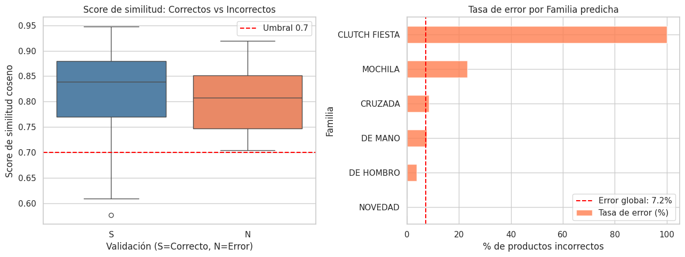
    


    
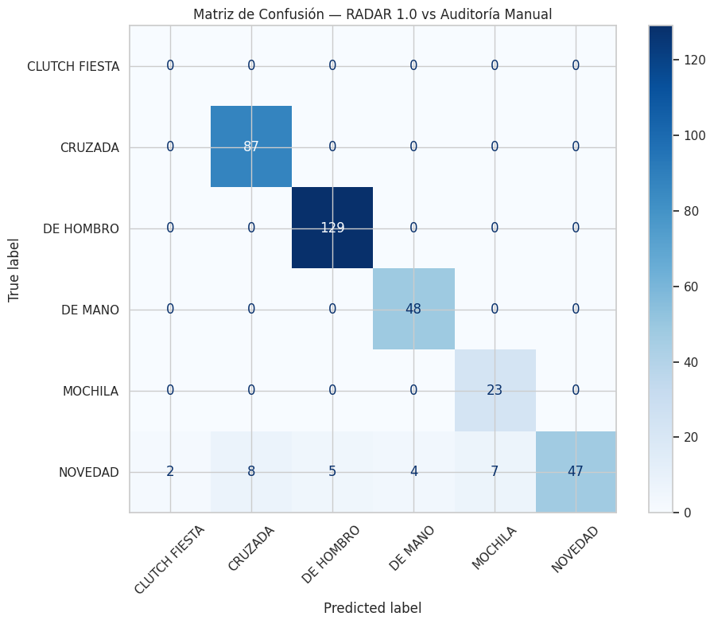
    


    
    Reporte de clasificación por familia:
                   precision    recall  f1-score   support
    
    CLUTCH FIESTA       0.00      0.00      0.00         0
          CRUZADA       0.92      1.00      0.96        87
        DE HOMBRO       0.96      1.00      0.98       129
          DE MANO       0.92      1.00      0.96        48
          MOCHILA       0.77      1.00      0.87        23
          NOVEDAD       1.00      0.64      0.78        73
    
         accuracy                           0.93       360
        macro avg       0.76      0.77      0.76       360
     weighted avg       0.94      0.93      0.92       360
    


```python
# Resumen de desempeño del baseline vs mínimos esperados

# Métricas calculadas en celdas anteriores (se usan variables existentes)
score_medio_semantico = df_competencia['score_similitud'].mean()
pct_cobertura         = (df_competencia['score_similitud'] >= threshold).mean() * 100
pct_novedad_total     = (df_competencia['Familia'] == 'NOVEDAD').mean() * 100
retailer_usados       = len(set(sim_matrix.argmax(axis=1)))
pct_catalogo_usado    = retailer_usados / len(df_retailer) * 100

# Resultados de auditoría (se usan si están disponibles, de lo contrario se usan valores hardcodeados)
# Ajusta estos valores si el CSV de auditoría fue completado y rellenado manualmente
EFECTIVIDAD_AUDITADA  = 100 - error_percentage   # % real de la auditoría
N_ERRORES_AUDITADOS   = error_count

print(f"{'='*62}")
print(f"  Tabla de Desempeño — RADAR 1.0 Baseline")
print(f"{'='*62}")
print(f"  {'Métrica':<38} {'Resultado':>10} {'Mínimo':>8}")
print(f"  {'-'*60}")
print(f"  {'Efectividad en auditoría manual':<38} {EFECTIVIDAD_AUDITADA:>9.1f}% {80.0:>7.1f}%")
print(f"  {'Errores auditados (límite AQL: 14)':<38} {N_ERRORES_AUDITADOS:>10} {'≤ 14':>8}")
print(f"  {'Score medio de similitud coseno':<38} {score_medio_semantico:>10.4f} {'>0.60':>8}")
print(f"  {'Cobertura (% con familia asignada)':<38} {pct_cobertura:>9.1f}% {'>50%':>8}")
print(f"  {'% clasificado como NOVEDAD':<38} {pct_novedad_total:>9.1f}% {'<40%':>8}")
print(f"  {'Cobertura catálogo Coppel':<38} {pct_catalogo_usado:>9.1f}% {'>30%':>8}")
print(f"{'='*62}")

# Veredicto por métrica
print("\nDiagnóstico por métrica:")
checks = [
    ("Efectividad mínima 80%",      EFECTIVIDAD_AUDITADA >= 80.0),
    ("Score medio > 0.60",          score_medio_semantico > 0.60),
    ("Cobertura > 50%",             pct_cobertura > 50.0),
    ("NOVEDAD < 40%",               pct_novedad_total < 40.0),
    ("Catálogo Coppel usado > 30%", pct_catalogo_usado > 30.0),
]
for nombre, cumple in checks:
    estado = "Cumple" if cumple else "No cumple"
    print(f"  {nombre:<35}: {estado}")
```

    ==============================================================
      Tabla de Desempeño — RADAR 1.0 Baseline
    ==============================================================
      Métrica                                 Resultado   Mínimo
      ------------------------------------------------------------
      Efectividad en auditoría manual             92.8%    80.0%
      Errores auditados (límite AQL: 14)             26     ≤ 14
      Score medio de similitud coseno            0.8137    >0.60
      Cobertura (% con familia asignada)          90.8%     >50%
      % clasificado como NOVEDAD                  10.0%     <40%
      Cobertura catálogo Coppel                   17.5%     >30%
    ==============================================================
    
    Diagnóstico por métrica:
      Efectividad mínima 80%             : Cumple
      Score medio > 0.60                 : Cumple
      Cobertura > 50%                    : Cumple
      NOVEDAD < 40%                      : Cumple
      Catálogo Coppel usado > 30%        : No cumple


## Cohesión Semántica de Familias — Silhouette Score y Distancia entre Centroides

El análisis de silhouette evalúa la calidad intrínseca del espacio de embeddings como soporte para la clasificación por familias: mide si cada producto está más cerca de los productos de su propia familia que de los de cualquier otra. Un score global cercano a 1 indica clusters bien separados; cercano a 0 indica solapamiento semántico entre familias.

El mapa de distancia entre centroides complementa este análisis mostrando qué familias comparten mayor proximidad semántica — lo que explica directamente dónde el modelo tiene mayor probabilidad de cometer errores de confusión.


```python
from sklearn.metrics import silhouette_samples, silhouette_score

# emb_ret_np ya está en memoria (generado en la sección de Filtrado y Extracción)
# Se usa la métrica coseno para ser consistente con la similitud coseno del modelo
labels_familia = df_retailer['Familia'].values

# Score global: referencia para el comité (rango -1 a 1, mayor es mejor)
score_global = silhouette_score(emb_ret_np, labels_familia, metric='cosine')

# Scores por muestra: permiten agregar por familia
scores_muestra = silhouette_samples(emb_ret_np, labels_familia, metric='cosine')

# Agregar score medio y desviación estándar por familia
df_retailer_sil = df_retailer.copy()
df_retailer_sil['silhouette'] = scores_muestra

df_sil_familia = (
    df_retailer_sil
    .groupby('Familia')['silhouette']
    .agg(score_medio='mean', score_std='std', n='count')
    .round(4)
    .sort_values('score_medio', ascending=True)
    .reset_index()
)

print(f"Silhouette Score global del espacio de embeddings (métrica coseno): {score_global:.4f}")
print()
print(df_sil_familia.to_string(index=False))

# Gráfico de barras horizontales con intervalo de ±1 std
fig, ax = plt.subplots(figsize=(9, 5))

colores = ['coral' if s < 0 else 'steelblue' for s in df_sil_familia['score_medio']]
ax.barh(df_sil_familia['Familia'], df_sil_familia['score_medio'],
        xerr=df_sil_familia['score_std'], color=colores, alpha=0.85,
        error_kw=dict(ecolor='gray', capsize=4, linewidth=1))

ax.axvline(score_global, color='red',   linestyle='--', linewidth=1.5, label=f'Score global: {score_global:.3f}')
ax.axvline(0,            color='black', linestyle='-',  linewidth=0.8, label='Límite de separación (0)')

ax.set_xlabel('Silhouette Score (coseno)')
ax.set_title('Cohesión Semántica por Familia — Silhouette Score en Espacio de Embeddings')
ax.legend(fontsize=9)
ax.grid(axis='x', alpha=0.3)
plt.tight_layout()
plt.show()
```

    Silhouette Score global del espacio de embeddings (métrica coseno): -0.0581
    
          Familia  score_medio  score_std    n
        DE HOMBRO      -0.0759     0.0706  873
          DE MANO      -0.0679     0.1040  695
          CRUZADA      -0.0660     0.0908 1299
          MOCHILA      -0.0397     0.0693  355
    CLUTCH FIESTA       0.3100     0.1059   71


    
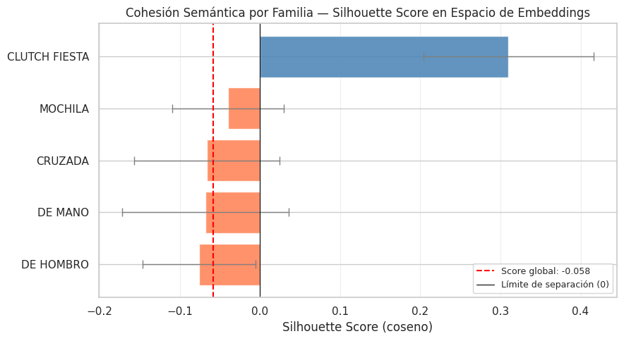
    


```python
# Calcular el centroide (embedding promedio) de cada familia
familias_unicas = df_retailer['Familia'].unique()

centroides = np.array([
    emb_ret_np[df_retailer['Familia'].values == f].mean(axis=0)
    for f in familias_unicas
])

# Matriz de similitud coseno entre centroides (familias × familias)
sim_centroides = cosine_similarity(centroides)

df_sim_centroides = pd.DataFrame(sim_centroides,
                                 index=familias_unicas,
                                 columns=familias_unicas)

# Ordenar por similitud promedio para agrupar familias cercanas en el heatmap
orden_familias = df_sim_centroides.mean(axis=1).sort_values(ascending=False).index

fig, ax = plt.subplots(figsize=(9, 7))
sns.heatmap(
    df_sim_centroides.loc[orden_familias, orden_familias],
    annot=True, fmt='.3f', cmap='Blues',
    vmin=0.5, vmax=1.0,
    linewidths=0.5, linecolor='white',
    ax=ax
)
ax.set_title('Similitud Coseno entre Centroides de Familias\n(1.0 = semánticamente idénticas, 0.5 = distintas)', fontsize=12)
ax.set_xlabel('Familia')
ax.set_ylabel('Familia')
plt.xticks(rotation=45, ha='right')
plt.tight_layout()
plt.show()

# Identificar el par de familias más similares (mayor riesgo de confusión)
np.fill_diagonal(sim_centroides, 0)
idx_max = np.unravel_index(sim_centroides.argmax(), sim_centroides.shape)
print(f"Par de familias con mayor solapamiento semántico:")
print(f"  {familias_unicas[idx_max[0]]} ↔ {familias_unicas[idx_max[1]]}: {sim_centroides[idx_max]:.4f}")
```


    
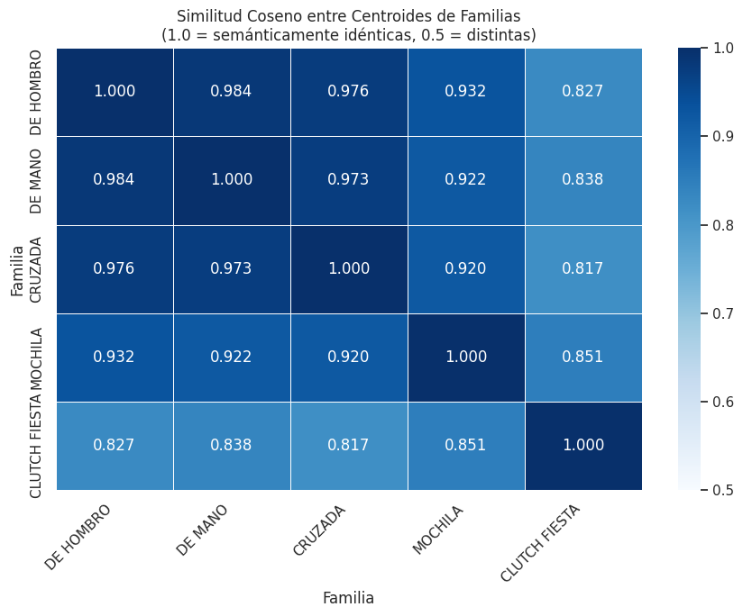
    


    Par de familias con mayor solapamiento semántico:
      DE MANO ↔ DE HOMBRO: 0.9837


### Diagnóstico de separabilidad semántica entre familias

Para evaluar si las familias definidas manualmente forman grupos naturalmente separables en el espacio de embeddings, se calculó el Silhouette Score usando distancia coseno. Esta métrica permite medir la cohesión interna de cada familia y su separación frente a las demás.

El resultado global fue de -0.0581, lo que indica un alto nivel de traslape semántico entre familias. Este hallazgo no invalida el modelo, sino que evidencia que algunas categorías, como DE HOMBRO, DE MANO y CRUZADA, son semánticamente cercanas y difíciles de separar únicamente con embeddings.

La familia CLUTCH FIESTA fue la única con un score positivo relevante, lo que sugiere que tiene una identidad semántica más clara dentro del catálogo. En cambio, las demás familias presentan scores cercanos o menores a cero, confirmando que el problema requiere una capa adicional de decisión, como recomendaciones Top-K, márgenes de confianza o revisión humana en casos ambiguos.

## Margen de Confianza entre Familias — Análisis de Ambigüedad de Clasificación

El análisis de silhouette demostró que las familias se solapan en el espacio de embeddings. El **margen de confianza** extiende ese hallazgo al nivel de producto individual: mide la diferencia entre el mejor score de la familia asignada y el mejor score de la segunda familia candidata. Un margen cercano a cero indica que el modelo no tiene evidencia clara para preferir una familia sobre otra, independientemente del score absoluto.


```python
# ── Margen de decisión: diferencia entre top-1 y top-2 familia ──────────────────────
# Para cada producto de competencia, obtenemos el mejor score dentro de cada familia
# del retailer. Cada celda representa el máximo score de similitud contra una familia.

familias_retailer = df_retailer['Familia'].values
familias_unicas_ret = np.unique(familias_retailer)

# Matriz de scores: filas = productos competencia, columnas = familias retailer
# Cada celda = max(similitud coseno) entre ese producto y todos los productos de esa familia
scores_por_familia = np.column_stack([
    sim_matrix[:, familias_retailer == fam].max(axis=1)
    for fam in familias_unicas_ret
])

# Ordenar scores descendente por fila para obtener top-1 y top-2
scores_ordenados = np.sort(scores_por_familia, axis=1)[:, ::-1]

top1_score = scores_ordenados[:, 0]
top2_score = scores_ordenados[:, 1]
margen = top1_score - top2_score

# Índices de la familia top-1 y top-2
top1_familia_idx = np.argsort(scores_por_familia, axis=1)[:, -1]
top2_familia_idx = np.argsort(scores_por_familia, axis=1)[:, -2]

top1_familia = familias_unicas_ret[top1_familia_idx]
top2_familia = familias_unicas_ret[top2_familia_idx]

# Consolidar DataFrame de análisis
# Familia_asignada_top1 = familia que realmente eligió el modelo por mayor score
# Familia_original = familia que venía en df_competencia, si existe como referencia
df_margen = pd.DataFrame({
    'Familia_asignada_top1': top1_familia,
    'Familia_rival_top2': top2_familia,
    'Familia_original': df_competencia['Familia'].values,
    'top1_score': top1_score,
    'top2_score': top2_score,
    'margen': margen
})

# Umbral de baja claridad de decisión
UMBRAL_MARGEN = 0.05

df_margen['zona_ambigua'] = df_margen['margen'] < UMBRAL_MARGEN

n_ambiguos = df_margen['zona_ambigua'].sum()
pct_ambiguos = n_ambiguos / len(df_margen) * 100

print(f"Margen promedio entre top-1 y top-2 familia: {df_margen['margen'].mean():.4f}")
print(f"Margen mediano:                              {df_margen['margen'].median():.4f}")
print(f"Productos con margen < {UMBRAL_MARGEN} (zona ambigua): {n_ambiguos} ({pct_ambiguos:.1f}%)")
print()
print("Estadísticos de margen por familia asignada por el modelo:")
print(
    df_margen
    .groupby('Familia_asignada_top1')['margen']
    .agg(['mean', 'median', 'min', 'count'])
    .round(4)
    .to_string()
)

# ── Visualización ─────────────────────────────────────────────────────────────────────
fig, axes = plt.subplots(1, 2, figsize=(14, 5))

# Panel izquierdo: distribución del margen coloreada por familia asignada
paleta = sns.color_palette('tab10', n_colors=len(df_margen['Familia_asignada_top1'].unique()))

for i, fam in enumerate(sorted(df_margen['Familia_asignada_top1'].unique())):
    subset = df_margen[df_margen['Familia_asignada_top1'] == fam]['margen']
    axes[0].hist(subset, bins=30, alpha=0.6, label=fam, color=paleta[i])

axes[0].axvline(
    UMBRAL_MARGEN,
    color='red',
    linestyle='--',
    linewidth=1.5,
    label=f'Umbral ambigüedad ({UMBRAL_MARGEN})\n{pct_ambiguos:.1f}% de productos'
)

axes[0].set_xlabel('Margen top-1 − top-2 por familia')
axes[0].set_ylabel('Número de productos')
axes[0].set_title('Distribución del Margen de Decisión por Familia Asignada')
axes[0].legend(fontsize=8)
axes[0].grid(alpha=0.3)

# Panel derecho: margen medio por familia asignada
margen_familia = (
    df_margen
    .groupby('Familia_asignada_top1')['margen']
    .mean()
    .sort_values()
)

colores_barra = ['coral' if v < UMBRAL_MARGEN else 'steelblue' for v in margen_familia]

margen_familia.plot(kind='barh', ax=axes[1], color=colores_barra, alpha=0.85)

axes[1].axvline(
    UMBRAL_MARGEN,
    color='red',
    linestyle='--',
    linewidth=1.5,
    label=f'Umbral ambigüedad ({UMBRAL_MARGEN})'
)

axes[1].axvline(
    df_margen['margen'].mean(),
    color='gray',
    linestyle=':',
    linewidth=1.2,
    label=f"Promedio global ({df_margen['margen'].mean():.3f})"
)

axes[1].set_xlabel('Margen promedio top-1 − top-2')
axes[1].set_ylabel('Familia asignada por el modelo')
axes[1].set_title('Margen de Decisión Promedio por Familia Asignada')
axes[1].legend(fontsize=8)
axes[1].grid(axis='x', alpha=0.3)

plt.suptitle(
    'Análisis de Ambigüedad: ¿Con qué claridad elige el modelo entre familias?',
    fontsize=12,
    fontweight='bold',
    y=1.01
)

plt.tight_layout()
plt.show()
```

    Margen promedio entre top-1 y top-2 familia: 0.0282
    Margen mediano:                              0.0232
    Productos con margen < 0.05 (zona ambigua): 4976 (82.6%)
    
    Estadísticos de margen por familia asignada por el modelo:
                             mean  median     min  count
    Familia_asignada_top1                               
    CLUTCH FIESTA          0.0195  0.0137  0.0003     64
    CRUZADA                0.0265  0.0213  0.0000   1544
    DE HOMBRO              0.0341  0.0305  0.0000   1924
    DE MANO                0.0243  0.0204  0.0000   1552
    MOCHILA                0.0257  0.0201  0.0001    941


    
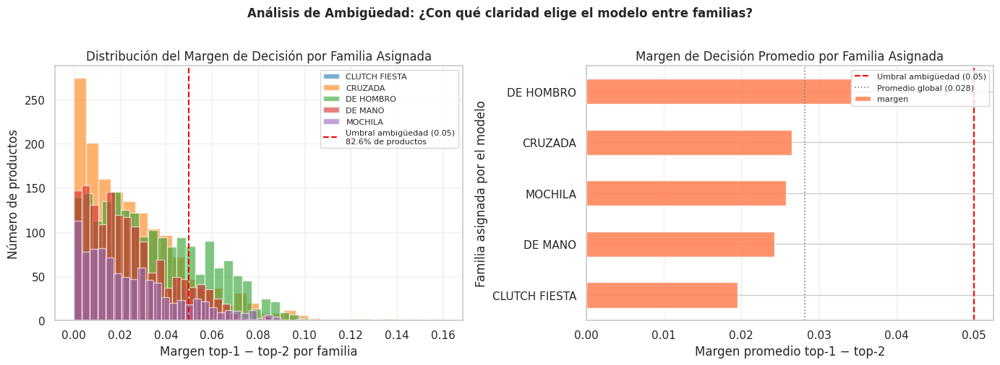
    


```python
# ── Matriz de rivalidad: top-1 vs top-2 familia en zona ambigua ──────────────────────
# Usa las columnas corregidas de df_margen:
# Familia_asignada_top1 = familia elegida por el modelo
# Familia_rival_top2 = segunda mejor familia candidata

df_ambiguos = df_margen[df_margen['zona_ambigua']].copy()

# Crosstab: filas = familia asignada top-1, columnas = familia rival top-2
tabla_rivalidad = pd.crosstab(
    df_ambiguos['Familia_asignada_top1'],
    df_ambiguos['Familia_rival_top2'],
    margins=False
)

# Normalizar por fila para ver proporción relativa de cada rival
tabla_rivalidad_pct = (
    tabla_rivalidad
    .div(tabla_rivalidad.sum(axis=1), axis=0)
    .round(3) * 100
)

print("Matriz de rivalidad — % de productos ambiguos por familia asignada que tiene a X como segunda opción:")
print(tabla_rivalidad_pct.to_string())

# Heatmap de rivalidad
fig, ax = plt.subplots(figsize=(9, 6))

sns.heatmap(
    tabla_rivalidad_pct,
    annot=True,
    fmt='.1f',
    cmap='OrRd',
    linewidths=0.5,
    linecolor='white',
    ax=ax,
    cbar_kws={'label': '% de productos en zona ambigua'}
)

ax.set_title(
    'Matriz de Rivalidad entre Familias\n'
    '(% de productos ambiguos cuya segunda opción es la columna)',
    fontsize=11
)

ax.set_xlabel('Familia rival top-2')
ax.set_ylabel('Familia asignada top-1 por el modelo')
plt.xticks(rotation=45, ha='right')
plt.tight_layout()
plt.show()
```

    Matriz de rivalidad — % de productos ambiguos por familia asignada que tiene a X como segunda opción:
    Familia_rival_top2     CLUTCH FIESTA  CRUZADA  DE HOMBRO  DE MANO  MOCHILA
    Familia_asignada_top1                                                     
    CLUTCH FIESTA                    0.0     27.9       37.7     26.2      8.2
    CRUZADA                          1.7      0.0       42.0     29.1     27.3
    DE HOMBRO                        1.9     35.5        0.0     41.1     21.5
    DE MANO                          2.0     25.3       34.1      0.0     38.7
    MOCHILA                          0.9     41.5       26.8     30.9      0.0


    
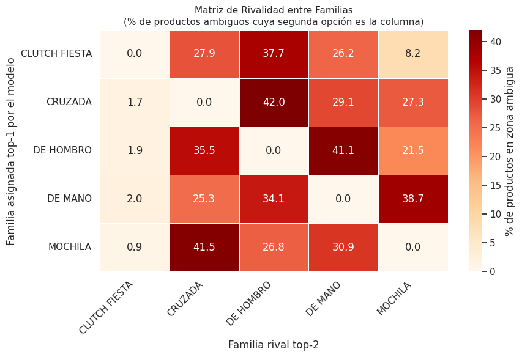
    


## Validación Cruzada de Arquitecturas — Similitud Semántica vs Clasificador Supervisado


```python
from sklearn.linear_model import LogisticRegression
from sklearn.feature_extraction.text import TfidfVectorizer
from sklearn.pipeline import Pipeline
from sklearn.metrics import classification_report

# El catálogo de Coppel ya etiquetado sirve como datos de entrenamiento
clf_pipeline = Pipeline([
    ('tfidf', TfidfVectorizer(max_features=5000, ngram_range=(1, 2))),
    ('clf',   LogisticRegression(max_iter=1000, C=1.0, class_weight='balanced'))
])

clf_pipeline.fit(df_retailer['canonical_input'], df_retailer['Familia'])

# Predicción sobre competencia
pred_supervisado = clf_pipeline.predict(df_competencia['canonical_input'])
prob_supervisado  = clf_pipeline.predict_proba(df_competencia['canonical_input']).max(axis=1)

# Comparar distribución contra el modelo actual
df_comparacion = pd.DataFrame({
    'RADAR_actual'    : df_competencia['Familia'].values,
    'Supervisado'     : pred_supervisado,
    'Confianza'       : prob_supervisado.round(3)
})

print("Distribución RADAR actual vs Clasificador Supervisado:")
print(pd.crosstab(df_comparacion['RADAR_actual'], df_comparacion['Supervisado'], margins=True))

print(f"\nConfianza promedio del clasificador supervisado: {prob_supervisado.mean():.3f}")
print(f"Confianza promedio del modelo actual (score coseno): {df_competencia['score_similitud'].mean():.3f}")
```

    Distribución RADAR actual vs Clasificador Supervisado:
    Supervisado    CLUTCH FIESTA  CRUZADA  DE HOMBRO  DE MANO  MOCHILA   All
    RADAR_actual                                                            
    CLUTCH FIESTA              0        7          2        0        0     9
    CRUZADA                    0     1545         18       84        6  1653
    DE HOMBRO                  1       51       2222       18        0  2292
    DE MANO                    8       88         15      817        0   928
    MOCHILA                    0      128         23       20      372   543
    NOVEDAD                    0      492         18       88        2   600
    All                        9     2311       2298     1027      380  6025
    
    Confianza promedio del clasificador supervisado: 0.784
    Confianza promedio del modelo actual (score coseno): 0.814


### Interpretación del Contraste

Ambos modelos convergen en una confianza promedio de ~0.78–0.81 y en una tasa de
acuerdo de 93–97% para las familias DE HOMBRO, DE MANO y CRUZADA. Esto valida las asignaciones del modelo RADAR: cuando dos arquitecturas independientes coinciden, la asignación es robusta.

Los desacuerdos son diagnósticos, no aleatorios. La familia MOCHILA concentra la mayor discrepancia (128 productos reclasificados como CRUZADA por el supervisor), lo cual esconsistente con el 23% de tasa de error observado en la auditoría manual, ambos enfoques detectan independientemente la misma zona de ambigüedad.

La diferencia en NOVEDAD no es un error del supervisado sino una limitación estructural: al estar entrenado exclusivamente con familias Coppel, no puede identificar productos fuera del catálogo. Esto confirma que la arquitectura de RADAR, con umbral de similitud como mecanismo de detección de novedades, es la apropiada para este caso de uso. El clasificador supervisado es un validador, no un reemplazo.


```python
# ANÁLISIS DE OFERTA POR CLUSTER (FAMILIA Y RANGOS)
# Homologar las columnas que contienen la misma información con distintos nombres
df_competencia = df_competencia.rename(columns={'Precio_anterior': 'Precio_reg'})
df_competencia = df_competencia.rename(columns={'Precio_actual': 'Precio_final'})
df_competencia = df_competencia.rename(columns={'SKU': 'Codigo'})
df_competencia = df_competencia.rename(columns={'Colores': 'Color'})

def analizar_rangos(Familia):
    # Consolidamos precios de la familia
    precios_ret = df_retailer[df_retailer['Familia'] == Familia]['Precio_final'].tolist()
    precios_comp = df_competencia[df_competencia['Familia'] == Familia]['Precio_final'].tolist()
    todos = precios_ret + precios_comp

    p_min, p_max = min(todos), max(todos)
    tier = (p_max - p_min) / 8

    # Definición de umbrales
    rangos = [
        ('bajo', p_min, p_min + tier),
        ('medio', p_min + tier, p_min + 3*tier),
        ('alto', p_min + 3*tier, p_max)
    ]

    print(f"\n{Familia.upper()}")
    for nombre, r_min, r_max in rangos:
        # Contamos SKUs en cada rango
        count_ret = sum(1 for p in precios_ret if r_min <= p <= r_max)
        count_comp = sum(1 for p in precios_comp if r_min <= p <= r_max)

        # Calculamos porcentajes
        pct_ret = (count_ret / len(precios_ret) * 100) if precios_ret else 0
        pct_comp = (count_comp / len(precios_comp) * 100) if precios_comp else 0

        print(f"Rango {nombre} (${int(r_min)} - ${int(r_max)}): Coppel {int(pct_ret)}% SKUs Competencia {int(pct_comp)}% SKUs")

print("\n--- ANÁLISIS DE POSICIONAMIENTO POR RANGOS ---")
for f in df_retailer['Familia'].unique():
    analizar_rangos(f)
```

    
    --- ANÁLISIS DE POSICIONAMIENTO POR RANGOS ---
    
    DE MANO
    Rango bajo ($49 - $2253): Coppel 76% SKUs Competencia 72% SKUs
    Rango medio ($2253 - $6662): Coppel 23% SKUs Competencia 24% SKUs
    Rango alto ($6662 - $17684): Coppel 0% SKUs Competencia 2% SKUs
    
    MOCHILA
    Rango bajo ($35 - $1279): Coppel 64% SKUs Competencia 43% SKUs
    Rango medio ($1279 - $3768): Coppel 35% SKUs Competencia 47% SKUs
    Rango alto ($3768 - $9990): Coppel 0% SKUs Competencia 8% SKUs
    
    CRUZADA
    Rango bajo ($25 - $2096): Coppel 89% SKUs Competencia 71% SKUs
    Rango medio ($2096 - $6240): Coppel 10% SKUs Competencia 25% SKUs
    Rango alto ($6240 - $16599): Coppel 0% SKUs Competencia 3% SKUs
    
    DE HOMBRO
    Rango bajo ($59 - $2430): Coppel 85% SKUs Competencia 72% SKUs
    Rango medio ($2430 - $7174): Coppel 14% SKUs Competencia 23% SKUs
    Rango alto ($7174 - $19034): Coppel 0% SKUs Competencia 3% SKUs
    
    CLUTCH FIESTA
    Rango bajo ($40 - $1147): Coppel 100% SKUs Competencia 22% SKUs
    Rango medio ($1147 - $3362): Coppel 0% SKUs Competencia 55% SKUs
    Rango alto ($3362 - $8900): Coppel 0% SKUs Competencia 22% SKUs


```python
df_retailer.head(1)
```


  <div id="df-9dd7492c-b3c1-4062-8f0d-2cde4812dfaa" class="colab-df-container">
    <div>
<style scoped>
    .dataframe tbody tr th:only-of-type {
        vertical-align: middle;
    }

    .dataframe tbody tr th {
        vertical-align: top;
    }

    .dataframe thead th {
        text-align: right;
    }
</style>
<table border="1" class="dataframe">
  <thead>
    <tr style="text-align: right;">
      <th></th>
      <th>Codigo</th>
      <th>Clase</th>
      <th>Familia</th>
      <th>Descripcion</th>
      <th>Tallas</th>
      <th>Marca</th>
      <th>Color</th>
      <th>Composicion</th>
      <th>Precio_reg</th>
      <th>Precio_final</th>
      <th>canonical_input</th>
    </tr>
  </thead>
  <tbody>
    <tr>
      <th>0</th>
      <td>300028</td>
      <td>BOLSAS</td>
      <td>DE MANO</td>
      <td>FW26 BOLSA CRUZADA CON FULL PRINT COLOR CAFE C...</td>
      <td>10</td>
      <td>JENNIFER LOPEZ</td>
      <td>BROWN</td>
      <td>SYNTHETIC 100%.</td>
      <td>549</td>
      <td>549</td>
      <td>fw26 bolsa cruzada con full print color cafe c...</td>
    </tr>
  </tbody>
</table>
</div>
    <div class="colab-df-buttons">

  <div class="colab-df-container">
    <button class="colab-df-convert" onclick="convertToInteractive('df-9dd7492c-b3c1-4062-8f0d-2cde4812dfaa')"
            title="Convert this dataframe to an interactive table."
            style="display:none;">

  <svg xmlns="http://www.w3.org/2000/svg" height="24px" viewBox="0 -960 960 960">
    <path d="M120-120v-720h720v720H120Zm60-500h600v-160H180v160Zm220 220h160v-160H400v160Zm0 220h160v-160H400v160ZM180-400h160v-160H180v160Zm440 0h160v-160H620v160ZM180-180h160v-160H180v160Zm440 0h160v-160H620v160Z"/>
  </svg>
    </button>

  <style>
    .colab-df-container {
      display:flex;
      gap: 12px;
    }

    .colab-df-convert {
      background-color: #E8F0FE;
      border: none;
      border-radius: 50%;
      cursor: pointer;
      display: none;
      fill: #1967D2;
      height: 32px;
      padding: 0 0 0 0;
      width: 32px;
    }

    .colab-df-convert:hover {
      background-color: #E2EBFA;
      box-shadow: 0px 1px 2px rgba(60, 64, 67, 0.3), 0px 1px 3px 1px rgba(60, 64, 67, 0.15);
      fill: #174EA6;
    }

    .colab-df-buttons div {
      margin-bottom: 4px;
    }

    [theme=dark] .colab-df-convert {
      background-color: #3B4455;
      fill: #D2E3FC;
    }

    [theme=dark] .colab-df-convert:hover {
      background-color: #434B5C;
      box-shadow: 0px 1px 3px 1px rgba(0, 0, 0, 0.15);
      filter: drop-shadow(0px 1px 2px rgba(0, 0, 0, 0.3));
      fill: #FFFFFF;
    }
  </style>

    <script>
      const buttonEl =
        document.querySelector('#df-9dd7492c-b3c1-4062-8f0d-2cde4812dfaa button.colab-df-convert');
      buttonEl.style.display =
        google.colab.kernel.accessAllowed ? 'block' : 'none';

      async function convertToInteractive(key) {
        const element = document.querySelector('#df-9dd7492c-b3c1-4062-8f0d-2cde4812dfaa');
        const dataTable =
          await google.colab.kernel.invokeFunction('convertToInteractive',
                                                    [key], {});
        if (!dataTable) return;

        const docLinkHtml = 'Like what you see? Visit the ' +
          '<a target="_blank" href=https://colab.research.google.com/notebooks/data_table.ipynb>data table notebook</a>'
          + ' to learn more about interactive tables.';
        element.innerHTML = '';
        dataTable['output_type'] = 'display_data';
        await google.colab.output.renderOutput(dataTable, element);
        const docLink = document.createElement('div');
        docLink.innerHTML = docLinkHtml;
        element.appendChild(docLink);
      }
    </script>
  </div>


    </div>
  </div>


```python
df_competencia.head(1)
```


  <div id="df-6586e2ed-ae30-42eb-9c13-85d801b2c037" class="colab-df-container">
    <div>
<style scoped>
    .dataframe tbody tr th:only-of-type {
        vertical-align: middle;
    }

    .dataframe tbody tr th {
        vertical-align: top;
    }

    .dataframe thead th {
        text-align: right;
    }
</style>
<table border="1" class="dataframe">
  <thead>
    <tr style="text-align: right;">
      <th></th>
      <th>Pagina</th>
      <th>Tienda</th>
      <th>Marca</th>
      <th>Producto</th>
      <th>Precio_reg</th>
      <th>Precio_final</th>
      <th>Color</th>
      <th>Descripcion</th>
      <th>Codigo</th>
      <th>Texto_completo</th>
      <th>Link</th>
      <th>canonical_input</th>
      <th>score_similitud</th>
      <th>Clase</th>
      <th>Familia</th>
      <th>Validacion</th>
      <th>Familia_correcta</th>
      <th>estrato</th>
    </tr>
  </thead>
  <tbody>
    <tr>
      <th>0</th>
      <td>10</td>
      <td>Suburbia</td>
      <td>ZESTINI</td>
      <td>Monedero Piaz para mujer</td>
      <td>361.0</td>
      <td>361.0</td>
      <td>Negro | Azul | Rosa | Dorado | Morado</td>
      <td>Elegante monedero mediano con un diseño entrec...</td>
      <td>Código de Producto: 99993411139</td>
      <td>Monedero Piaz para mujer</td>
      <td>https://www.suburbia.com.mx/tienda/pdp/moneder...</td>
      <td>monedero piaz para mujer zestini negro azul ro...</td>
      <td>0.777944</td>
      <td>BOLSAS</td>
      <td>CRUZADA</td>
      <td></td>
      <td></td>
      <td>Media</td>
    </tr>
  </tbody>
</table>
</div>
    <div class="colab-df-buttons">

  <div class="colab-df-container">
    <button class="colab-df-convert" onclick="convertToInteractive('df-6586e2ed-ae30-42eb-9c13-85d801b2c037')"
            title="Convert this dataframe to an interactive table."
            style="display:none;">

  <svg xmlns="http://www.w3.org/2000/svg" height="24px" viewBox="0 -960 960 960">
    <path d="M120-120v-720h720v720H120Zm60-500h600v-160H180v160Zm220 220h160v-160H400v160Zm0 220h160v-160H400v160ZM180-400h160v-160H180v160Zm440 0h160v-160H620v160ZM180-180h160v-160H180v160Zm440 0h160v-160H620v160Z"/>
  </svg>
    </button>

  <style>
    .colab-df-container {
      display:flex;
      gap: 12px;
    }

    .colab-df-convert {
      background-color: #E8F0FE;
      border: none;
      border-radius: 50%;
      cursor: pointer;
      display: none;
      fill: #1967D2;
      height: 32px;
      padding: 0 0 0 0;
      width: 32px;
    }

    .colab-df-convert:hover {
      background-color: #E2EBFA;
      box-shadow: 0px 1px 2px rgba(60, 64, 67, 0.3), 0px 1px 3px 1px rgba(60, 64, 67, 0.15);
      fill: #174EA6;
    }

    .colab-df-buttons div {
      margin-bottom: 4px;
    }

    [theme=dark] .colab-df-convert {
      background-color: #3B4455;
      fill: #D2E3FC;
    }

    [theme=dark] .colab-df-convert:hover {
      background-color: #434B5C;
      box-shadow: 0px 1px 3px 1px rgba(0, 0, 0, 0.15);
      filter: drop-shadow(0px 1px 2px rgba(0, 0, 0, 0.3));
      fill: #FFFFFF;
    }
  </style>

    <script>
      const buttonEl =
        document.querySelector('#df-6586e2ed-ae30-42eb-9c13-85d801b2c037 button.colab-df-convert');
      buttonEl.style.display =
        google.colab.kernel.accessAllowed ? 'block' : 'none';

      async function convertToInteractive(key) {
        const element = document.querySelector('#df-6586e2ed-ae30-42eb-9c13-85d801b2c037');
        const dataTable =
          await google.colab.kernel.invokeFunction('convertToInteractive',
                                                    [key], {});
        if (!dataTable) return;

        const docLinkHtml = 'Like what you see? Visit the ' +
          '<a target="_blank" href=https://colab.research.google.com/notebooks/data_table.ipynb>data table notebook</a>'
          + ' to learn more about interactive tables.';
        element.innerHTML = '';
        dataTable['output_type'] = 'display_data';
        await google.colab.output.renderOutput(dataTable, element);
        const docLink = document.createElement('div');
        docLink.innerHTML = docLinkHtml;
        element.appendChild(docLink);
      }
    </script>
  </div>


    </div>
  </div>


```python
df_tableau = pd.concat([df_retailer, df_competencia], axis=0)
df_tableau.drop(columns=['Pagina','Texto_completo','Validacion','Familia_correcta','estrato','Producto','Composicion'], inplace=True)
df_tableau.tail(1)
```


  <div id="df-d8f53fdd-2f59-445b-8741-80b4cb6fff3e" class="colab-df-container">
    <div>
<style scoped>
    .dataframe tbody tr th:only-of-type {
        vertical-align: middle;
    }

    .dataframe tbody tr th {
        vertical-align: top;
    }

    .dataframe thead th {
        text-align: right;
    }
</style>
<table border="1" class="dataframe">
  <thead>
    <tr style="text-align: right;">
      <th></th>
      <th>Codigo</th>
      <th>Clase</th>
      <th>Familia</th>
      <th>Descripcion</th>
      <th>Tallas</th>
      <th>Marca</th>
      <th>Color</th>
      <th>Precio_reg</th>
      <th>Precio_final</th>
      <th>canonical_input</th>
      <th>Tienda</th>
      <th>Link</th>
      <th>score_similitud</th>
    </tr>
  </thead>
  <tbody>
    <tr>
      <th>6024</th>
      <td>NaN</td>
      <td>BOLSAS</td>
      <td>NOVEDAD</td>
      <td>Cartera para mujer</td>
      <td>NaN</td>
      <td>1818</td>
      <td>Azul | Gris | Rosa | Negro</td>
      <td>449.0</td>
      <td>449.0</td>
      <td>cartera para mujer 1818 azul gris rosa negro</td>
      <td>Suburbia</td>
      <td>https://www.suburbia.com.mx/tienda/pdp/cartera...</td>
      <td>0.713316</td>
    </tr>
  </tbody>
</table>
</div>
    <div class="colab-df-buttons">

  <div class="colab-df-container">
    <button class="colab-df-convert" onclick="convertToInteractive('df-d8f53fdd-2f59-445b-8741-80b4cb6fff3e')"
            title="Convert this dataframe to an interactive table."
            style="display:none;">

  <svg xmlns="http://www.w3.org/2000/svg" height="24px" viewBox="0 -960 960 960">
    <path d="M120-120v-720h720v720H120Zm60-500h600v-160H180v160Zm220 220h160v-160H400v160Zm0 220h160v-160H400v160ZM180-400h160v-160H180v160Zm440 0h160v-160H620v160ZM180-180h160v-160H180v160Zm440 0h160v-160H620v160Z"/>
  </svg>
    </button>

  <style>
    .colab-df-container {
      display:flex;
      gap: 12px;
    }

    .colab-df-convert {
      background-color: #E8F0FE;
      border: none;
      border-radius: 50%;
      cursor: pointer;
      display: none;
      fill: #1967D2;
      height: 32px;
      padding: 0 0 0 0;
      width: 32px;
    }

    .colab-df-convert:hover {
      background-color: #E2EBFA;
      box-shadow: 0px 1px 2px rgba(60, 64, 67, 0.3), 0px 1px 3px 1px rgba(60, 64, 67, 0.15);
      fill: #174EA6;
    }

    .colab-df-buttons div {
      margin-bottom: 4px;
    }

    [theme=dark] .colab-df-convert {
      background-color: #3B4455;
      fill: #D2E3FC;
    }

    [theme=dark] .colab-df-convert:hover {
      background-color: #434B5C;
      box-shadow: 0px 1px 3px 1px rgba(0, 0, 0, 0.15);
      filter: drop-shadow(0px 1px 2px rgba(0, 0, 0, 0.3));
      fill: #FFFFFF;
    }
  </style>

    <script>
      const buttonEl =
        document.querySelector('#df-d8f53fdd-2f59-445b-8741-80b4cb6fff3e button.colab-df-convert');
      buttonEl.style.display =
        google.colab.kernel.accessAllowed ? 'block' : 'none';

      async function convertToInteractive(key) {
        const element = document.querySelector('#df-d8f53fdd-2f59-445b-8741-80b4cb6fff3e');
        const dataTable =
          await google.colab.kernel.invokeFunction('convertToInteractive',
                                                    [key], {});
        if (!dataTable) return;

        const docLinkHtml = 'Like what you see? Visit the ' +
          '<a target="_blank" href=https://colab.research.google.com/notebooks/data_table.ipynb>data table notebook</a>'
          + ' to learn more about interactive tables.';
        element.innerHTML = '';
        dataTable['output_type'] = 'display_data';
        await google.colab.output.renderOutput(dataTable, element);
        const docLink = document.createElement('div');
        docLink.innerHTML = docLinkHtml;
        element.appendChild(docLink);
      }
    </script>
  </div>


    </div>
  </div>


```python
df_tableau['Tienda'] = df_tableau['Tienda'].fillna('Coppel')
df_tableau.head(1)
```


  <div id="df-aa6f7393-8d90-4838-9d93-fbfa779302b6" class="colab-df-container">
    <div>
<style scoped>
    .dataframe tbody tr th:only-of-type {
        vertical-align: middle;
    }

    .dataframe tbody tr th {
        vertical-align: top;
    }

    .dataframe thead th {
        text-align: right;
    }
</style>
<table border="1" class="dataframe">
  <thead>
    <tr style="text-align: right;">
      <th></th>
      <th>Codigo</th>
      <th>Clase</th>
      <th>Familia</th>
      <th>Descripcion</th>
      <th>Tallas</th>
      <th>Marca</th>
      <th>Color</th>
      <th>Precio_reg</th>
      <th>Precio_final</th>
      <th>canonical_input</th>
      <th>Tienda</th>
      <th>Link</th>
      <th>score_similitud</th>
    </tr>
  </thead>
  <tbody>
    <tr>
      <th>0</th>
      <td>300028</td>
      <td>BOLSAS</td>
      <td>DE MANO</td>
      <td>FW26 BOLSA CRUZADA CON FULL PRINT COLOR CAFE C...</td>
      <td>10</td>
      <td>JENNIFER LOPEZ</td>
      <td>BROWN</td>
      <td>549.0</td>
      <td>549.0</td>
      <td>fw26 bolsa cruzada con full print color cafe c...</td>
      <td>Coppel</td>
      <td>NaN</td>
      <td>NaN</td>
    </tr>
  </tbody>
</table>
</div>
    <div class="colab-df-buttons">

  <div class="colab-df-container">
    <button class="colab-df-convert" onclick="convertToInteractive('df-aa6f7393-8d90-4838-9d93-fbfa779302b6')"
            title="Convert this dataframe to an interactive table."
            style="display:none;">

  <svg xmlns="http://www.w3.org/2000/svg" height="24px" viewBox="0 -960 960 960">
    <path d="M120-120v-720h720v720H120Zm60-500h600v-160H180v160Zm220 220h160v-160H400v160Zm0 220h160v-160H400v160ZM180-400h160v-160H180v160Zm440 0h160v-160H620v160ZM180-180h160v-160H180v160Zm440 0h160v-160H620v160Z"/>
  </svg>
    </button>

  <style>
    .colab-df-container {
      display:flex;
      gap: 12px;
    }

    .colab-df-convert {
      background-color: #E8F0FE;
      border: none;
      border-radius: 50%;
      cursor: pointer;
      display: none;
      fill: #1967D2;
      height: 32px;
      padding: 0 0 0 0;
      width: 32px;
    }

    .colab-df-convert:hover {
      background-color: #E2EBFA;
      box-shadow: 0px 1px 2px rgba(60, 64, 67, 0.3), 0px 1px 3px 1px rgba(60, 64, 67, 0.15);
      fill: #174EA6;
    }

    .colab-df-buttons div {
      margin-bottom: 4px;
    }

    [theme=dark] .colab-df-convert {
      background-color: #3B4455;
      fill: #D2E3FC;
    }

    [theme=dark] .colab-df-convert:hover {
      background-color: #434B5C;
      box-shadow: 0px 1px 3px 1px rgba(0, 0, 0, 0.15);
      filter: drop-shadow(0px 1px 2px rgba(0, 0, 0, 0.3));
      fill: #FFFFFF;
    }
  </style>

    <script>
      const buttonEl =
        document.querySelector('#df-aa6f7393-8d90-4838-9d93-fbfa779302b6 button.colab-df-convert');
      buttonEl.style.display =
        google.colab.kernel.accessAllowed ? 'block' : 'none';

      async function convertToInteractive(key) {
        const element = document.querySelector('#df-aa6f7393-8d90-4838-9d93-fbfa779302b6');
        const dataTable =
          await google.colab.kernel.invokeFunction('convertToInteractive',
                                                    [key], {});
        if (!dataTable) return;

        const docLinkHtml = 'Like what you see? Visit the ' +
          '<a target="_blank" href=https://colab.research.google.com/notebooks/data_table.ipynb>data table notebook</a>'
          + ' to learn more about interactive tables.';
        element.innerHTML = '';
        dataTable['output_type'] = 'display_data';
        await google.colab.output.renderOutput(dataTable, element);
        const docLink = document.createElement('div');
        docLink.innerHTML = docLinkHtml;
        element.appendChild(docLink);
      }
    </script>
  </div>


    </div>
  </div>


```python
df_tableau.to_csv("resultados_modelo.csv", index=False)
```

# Conclusiones

* **El problema de separación es estructural, no solo de umbral.** El Silhouette Score global de −0.058 demuestra que las familias DE HOMBRO, DE MANO y CRUZADA no forman clusters separables en el espacio de embeddings: sus centroides tienen similitud coseno de 0.97–0.98, lo que significa que el modelo opera sobre una taxonomía que el lenguaje natural no distingue con claridad. El error de clasificación no es evitable con ajustes de umbral; es consecuencia de la definición misma de las categorías.

* **CRUZADA actúa como atractor semántico del catálogo.** Con 1,299 productos; es decir, la familia más grande, CRUZADA aparece como segunda opción en el 22–33% de los casos ambiguos de cualquier otra familia. El sesgo no proviene del modelo, sino del desbalance en el catálogo de referencia que el modelo utiliza para tomar decisiones.

* **El pipeline de embeddings semánticos es válido como primera capa de inteligencia competitiva**, pero sus resultados deben interpretarse como señales de proximidad de mercado, no como asignaciones de categoría con certeza. La arquitectura correcta para producción combina el score de similitud coseno con un margen mínimo de confianza y escalamiento humano para la zona ambigua.
